# Separação de Responsabilidades (Separation of Concerns)

*Do código monolítico às arquiteturas modernas*

**Autores:** João Carlos Barsan & Genésio (Gemini)

**Formato:** Edição Técnica / Livro Didático

> Produzido com auxílio de inteligência artificial.

## 📑 Sumário Geral da Obra

- **Parte I: Fundamentos e Gênese Teórica**
  - **Capítulo 1: O Que É Separação de Preocupações (SoC) e Por Que Ela Existe?** *(Neste capítulo)*
  - **Capítulo 2:** A Fronteira entre SoC e Princípios Clássicos (SRP, Coesão e Acoplamento)
- **Parte II: Arquitetura e Modelagem de Sistemas**
  - **Capítulo 3:** O Impacto do SoC nas Arquiteturas de Referência (MVC, Hexagonal, Clean Architecture e Microfrontends)
  - **Capítulo 4:** Efeitos Colaterais, Limites Práticos e a Armadilha do *Overengineering*
- **Parte III: Engenharia na Prática (Full Stack)**
  - **Capítulo 5:** Refatoração Prática de Frontend: De Componentes Monolíticos a Camadas Desacopladas
  - **Capítulo 6:** Refatoração Prática de Backend: Regra de Negócio, Persistência e Protocolo
- **Parte IV: A Próxima Fronteira**
  - **Capítulo 7:** SoC na Era do Desenvolvimento Guiado por IA: *Context Windows*, Agentes Autônomos e Testabilidade
- **Apêndice:** Bibliografia Técnica Fundamental e Leituras Recomendadas

# Capítulo 1: O Que É Separação de Responsabilidades (SoC) e Por Que Ela Existe?

> *"Let me try to explain to you, once and for all, the characteristics of someone who has mastered the art of thinking: it is the ability to maintain multiple viewpoints and focus one's attention upon one aspect in isolation, knowing that this is only one aspect."*
>
> — **Edsger W. Dijkstra**, *On the role of scientific thought* (1974)

## 1.1 🎯 A Essência do Conceito

Em engenharia de software, **Separação de Responsabilidades** (do inglês *Separation of Concerns* — SoC) é o princípio arquitetural que determina que um sistema deve ser decomposto em partes distintas, onde cada parte lida com uma preocupação (*concern*) específica e bem delimitada.

Uma **preocupação** não é simplesmente uma função ou uma classe; é um **foco de atenção conceitual** ou um aspecto de valor dentro do ciclo de vida da aplicação. Exemplos de preocupações distintas:

- Como os dados são armazenados e consultados em um banco de dados (*Persistência*).
- Quais são as regras do negócio que validam uma transação financeira (*Domínio/Lógica de Negócio*).
- Como apresentar os dados na tela do navegador de forma acessível e responsiva (*Apresentação/UI*).
- Quem tem permissão para disparar essa operação (*Segurança/Autenticação*).
- Como o sistema registra falhas e métricas de desempenho (*Observabilidade/Logging*).

Quando essas preocupações se misturam dentro de um mesmo módulo, ocorre o fenômeno conhecido na literatura como **Emaranhamento de Código** (*code tangling*) e **Dispersão de Código** (*code scattering*). O objetivo primordial do SoC é garantir que você possa alterar **como o dado é exibido** sem arriscar quebrar **como a conta financeira é calculada**, ou trocar o provedor de banco de dados sem tocar na interface com o usuário.

## 1.2 💡 Analogia do Cotidiano: O Restaurante Profissional

Pense em um restaurante convencional de médio porte. Para funcionar sem colapso diário, ele opera com uma clara separação de preocupações:

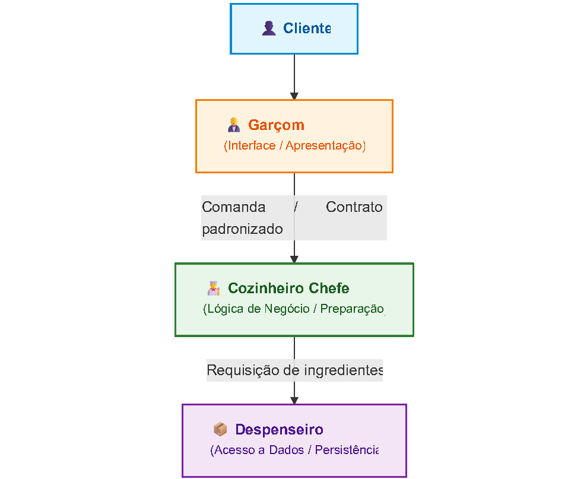

- **O Garçom:** Preocupa-se com o atendimento ao cliente, apresentação do cardápio, anotação do pedido e entrega do prato. Ele não entra na cozinha para picar cebolas nem precisa saber a temperatura exata do forno.
- **O Cozinheiro:** Preocupa-se exclusivamente em transformar matéria-prima em pratos saborosos e seguros, seguindo receitas rigorosas. Ele não atende telefone de clientes nem negocia preços com fornecedores na hora da cocção.
- **O Despenseiro/Estoque:** Preocupa-se com armazenamento, validade e organização dos ingredientes.

**O que seria o anti-padrão (falta de SoC)?**

Imagine se o garçom anotasse o pedido, corresse para o fogão, cozinhasse o arroz, fosse ao porão buscar um pacote de sal e depois voltasse para passar o cartão de crédito do cliente. Em um dia calmo com um único cliente, talvez funcione. Sob a menor carga de pico, pedidos atrasam, a comida queima, erros de cobrança ocorrem e nenhum dos envolvidos consegue otimizar seu processo.

No software, misturar consulta SQL dentro do manipulador de clique de botão de um formulário web é o exato equivalente de colocar o cozinheiro para operar a máquina de cartão no meio do almoço.

## 1.3 🧠 O Problema Real que o SoC Resolve: Carga Cognitiva e Custo de Mudança

Muitos desenvolvedores acreditam que organizar código serve apenas para torná-lo "bonito" ou "elegante". Trata-se de um equívoco perigoso. O SoC existe para contornar uma limitação biológica: **a memória de trabalho finita do cérebro humano**.

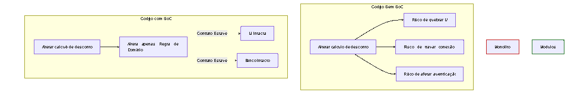

### 1. Redução da Carga Cognitiva

Ao corrigir um defeito no cálculo de juros, o engenheiro não deveria ser obrigado a carregar na mente as peculiaridades do protocolo HTTP, o schema de tabelas no PostgreSQL ou os estados de foco do React. O SoC permite o **isolamento mental**: você olha para uma unidade de 80 linhas focada em matemática financeira e raciocina exclusivamente sobre ela.

### 2. Minimização do Custo de Mudança

Requisitos de software mudam em ritmos diferentes:

- As regras tributárias mudam por determinações legais.
- A interface de usuário muda frequentemente por experimentos de UX ou identidade visual.
- O driver de banco de dados muda por migração tecnológica ou escala.

Se tudo estiver no mesmo arquivo ou camada, qualquer alteração exige retestar o sistema inteiro e eleva a chance de efeitos colaterais catastróficos.

## 1.4 🛠 Estudo de Caso Prático: "Antes e Depois"

Para consolidar o conceito, analisemos um caso clássico do desenvolvimento moderno: um endpoint de processamento de pedidos de e-commerce.

### ❌ O Cenário "Antes": O Monolito Acoplado (God Function)

Neste exemplo em TypeScript (Node.js/Express), um único manipulador de rota faz absolutamente tudo: valida cabeçalhos, calcula preços, executa comandos SQL brutos, envia e-mails e formata HTML.

```typescript
// ❌ ANTES: Mistura de apresentação, banco, negócio e infraestrutura app.post("/api/checkout", async (req: Request, res: Response) => {
  // 1. Preocupação: Autenticação/Protocolo HTTP
  const authHeader = req.headers.authorization;
  if (!authHeader || !authHeader.startsWith("Bearer ")) {
    return res.status(401).json({ error: "Token ausente" });
  }

  // 2. Preocupação: Validação de Payload
  const { items, customerId } = req.body;
  if (!items || items.length === 0) {
    return res.status(400).json({ error: "Carrinho vazio" });
  }

  try {
    // 3. Preocupação: Acesso a Dados / Persistência
    const userQuery = await db.query("SELECT email, tier FROM users WHERE id = $1", [customerId]);
    const user = userQuery.rows[0];

    // 4. Preocupação: Regra de Negócio Crucial (Cálculo de Desconto)
    let total = 0;
    for (const item of items) {
      total += item.price * item.quantity;
    }
    if (user.tier === "VIP" && total > 200) {
      total = total * 0.85; // 15% de desconto
    }

    // 5. Preocupação: Persistência de Transação
    const orderResult = await db.query(
      "INSERT INTO orders (user_id, total_amount, status) VALUES ($1, $2, 'PAID') RETURNING id",
      [customerId, total]
    );

    // 6. Preocupação: Integração Externa (E-mail / Notificação)
    const emailHtml = `<h1>Pedido #${orderResult.rows[0].id} confirmado!</h1><p>Total: R$${total}</p>`;
    await smtpTransporter.sendMail({
      to: user.email,
      subject: "Seu Pedido Chegou",
      html: emailHtml,
    });

    // 7. Retorno de Apresentação
    return res.status(201).json({ success: true, orderId: orderResult.rows[0].id, total });
  } catch (err) {
    console.error("Erro no checkout:", err);
    return res.status(500).json({ error: "Falha interna" });
  }
});
```

**Por que este código é perigoso?**

1. **Incapaz de ser testado isoladamente:** Para testar se o desconto VIP de 15% está funcionando, é obrigatório levantar um banco de dados real e um servidor de envio de e-

> mail mockado.

2. **Duplicação iminente:** Se um processo em lote ou um consumidor de mensageria (Kafka/RabbitMQ) precisar criar pedidos sem passar pela rota HTTP, a lógica de cálculo precisará ser duplicada via "copiar e colar".

### ✅ O Cenário "Depois": Isolamento de Preocupações com Contratos

Separamos a solução em três camadas autônomas conectadas por interfaces explícitas:

1. **Domínio (Regra de Negócio Pura):** Sem dependência de bibliotecas web ou drivers de banco.
2. **Infraestrutura/Persistência:** Cuida unicamente de interagir com o PostgreSQL e serviços externos.
3. **Controlador (Apresentação/Transporte):** Lida com o protocolo HTTP.

```typescript
// 1. PREOCUPAÇÃO: DOMÍNIO & REGRA DE NEGÓCIO PURA (order-calculator.ts)
// Independe de HTTP, Express ou SQL. Pode ser testada em milissegundos.
export interface OrderItem {
  id: string;
  price: number;
  quantity: number;
}

export class OrderCalculator {
  public static calculateTotal(items: OrderItem[], userTier: string): number {
    const rawTotal = items.reduce((sum, item) => sum + item.price * item.quantity, 0);

    const qualifiesForVipDiscount = userTier === "VIP" && rawTotal > 200;
    return qualifiesForVipDiscount ? rawTotal * 0.85 : rawTotal;
  }
}

// 2. PREOCUPAÇÃO: CONTRATOS E REPOSITÓRIOS (ports.ts)
export interface OrderRepository {
  getUserTierAndEmail(userId: string): Promise<{ tier: string; email: string }>;
  saveOrder(userId: string, total: number): Promise<string>;
}

export interface NotificationService {
  notifyOrderCreated(email: string, orderId: string, total: number): Promise<void>;
}

// 3. PREOCUPAÇÃO: CASO DE USO / APLICAÇÃO (checkout-usecase.ts)
// Orquestra a execução sem saber como o HTTP funciona
export class CheckoutUseCase {
  constructor(
    private readonly orderRepo: OrderRepository,
    private readonly notifier: NotificationService
  ) {}

  async execute(userId: string, items: OrderItem[]): Promise<{ orderId: string; total: number}> {
    const user = await this.orderRepo.getUserTierAndEmail(userId);
    const total = OrderCalculator.calculateTotal(items, user.tier);
    const orderId = await this.orderRepo.saveOrder(userId, total);

    // Notificação disparada de forma desacoplada
    await this.notifier.notifyOrderCreated(user.email, orderId, total);

    return { orderId, total };
  }
}

// 4. PREOCUPAÇÃO: CONTROLADOR HTTP (checkout-controller.ts)
// Foca estritamente na validação de entrada, status codes e serialização JSON
export class CheckoutController {
  constructor(private readonly checkoutUseCase: CheckoutUseCase) {}

  async handle(req: Request, res: Response): Promise<Response> {
    const { items, customerId } = req.body;

    if (!items || items.length === 0) {
      return res.status(400).json({ error: "Carrinho vazio" });
    }

    try {
      const result = await this.checkoutUseCase.execute(customerId, items);
      return res.status(201).json(result);
    } catch (error) {
      return res.status(500).json({ error: "Erro ao processar checkout" });
    }
  }
}
```

## 1.5 📌 Dicas e Observações do Engenheiro

- 💡 **Separação lógica não exige separação física de arquivos minúsculos:** Você não precisa quebrar um arquivo de 30 linhas em cinco módulos de 6 linhas apenas para satisfazer um dogma. A separação deve ocorrer principalmente nas **fronteiras de responsabilidade**.
- ⚠ **Cuidado com o "Vazamento de Abstrações":** Se a sua camada de domínio importar tipos específicos do banco de dados (como tipos de colunas do TypeORM ou ObjectId do MongoDB), o SoC foi quebrado. As regras de negócio devem ser autossuficientes.
- 🔍 **O teste decisivo:** Pergunte-se: *"Se eu substituir a minha API REST por uma interface de linha de comando (CLI) ou fila Kafka amanhã, quanto da minha lógica de cálculo terá de ser reescrita?"* Se a resposta for superior a zero, suas preocupações ainda estão emaranhadas.

# Capítulo 2: A Fronteira entre SoC e Princípios Clássicos (SRP, Coesão e Acoplamento)

> *"Gather together the things that change for the same reasons. Separate those things that change for different reasons."*
>
> — **Robert C. Martin (Uncle Bob)**, *Clean Architecture*

## 2.1 🧭 Desfazendo a Confusão Semântica: SoC vs. SRP

Nos fóruns técnicos e discussões de arquitetura, é comum encontrar desenvolvedores tratando **Separação de Responsabilidades** (*Separation of Concerns* — SoC) e o **Princípio da Responsabilidade Única** (*Single Responsibility Principle* — SRP) como sinônimos intercambiáveis.

Essa equivalência simplista é um dos maiores causadores de erros estruturais em sistemas modernos. Embora ambos compartilhem a mesma raiz filosófica (dividir para conquistar), eles atuam em **escalas conceituais e níveis de granularidade distintos**:

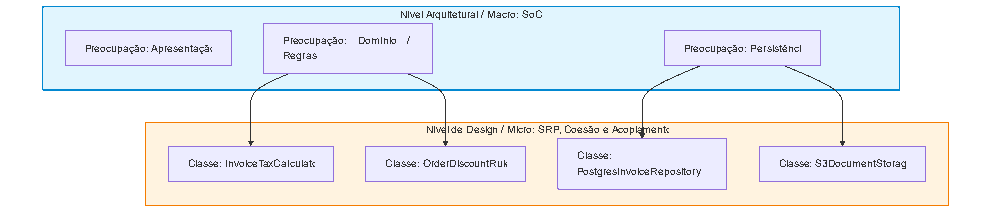

| **Dimensão** | **Separação de Responsabilidades (SoC)** | **Princípio da Responsabilidade Única (SRP)** |
|---|---|---|
| **Origem Histórica** | Edsger W. Dijkstra (1974) | Robert C. Martin / SOLID (início dos anos 2000) |
| **Escopo Primário** | **Macro/Sistêmico:** Divisão de camadas, subsistemas e aspectos operacionais (ex: UI, banco, rede, regras). | **Micro/Componente:** Classes, funções, módulos individuais ou agregados de código. |
| **Definição Operacional** | Isolar diferentes dimensões de interesse para que mudem de forma independente. | Uma unidade deve ter apenas **uma razão para mudar** (isto é, responder a um único ator/stakeholder). |
| **Pergunta- chave** | *"Essa camada mistura lógica de protocolo com armazenamento de dados?"* | *"Essa classe atende tanto ao Diretor Financeiro quanto ao Analista de RH?"* |

Em suma: **SoC é a bússola que organiza as fronteiras do sistema em camadas ou domínios funcionais; o SRP é a régua que afere o propósito de cada classe dentro dessas fronteiras.**

## 2.2 📐 A Tríade da Engenharia: Coesão, Acoplamento e SoC

Para entender por que o SoC funciona, precisamos analisar as duas forças fundamentais que governam a qualidade de qualquer software: **Coesão** e **Acoplamento**. Elas funcionam como grandezas vetoriais em um cabo de guerra constante.


### 1. Alta Coesão (O que pertence ao mesmo lugar)

Coesão mede o quanto os elementos dentro de um mesmo módulo ou classe colaboram para realizar **um único objetivo unificado**.

- **Baixa Coesão (Ruim):** Uma classe `UserManager` que valida senhas, grava no banco via SQL, dispara e-mails de marketing e gera relatórios em PDF. Os métodos não compartilham estado nem propósito coerente.
- **Alta Coesão (Boa):** Uma classe `PasswordHasher` cujo único foco de existência é receber uma string de texto puro e devolver/validar o hash com salt criptográfico.

### 2. Baixo Acoplamento (A liberdade das amarras)

Acoplamento afere o grau de interdependência entre dois ou mais módulos.

- **Alto Acoplamento (Risco Crítico):** O Módulo A acessa diretamente variáveis privadas ou tabelas internas do Módulo B. Uma alteração de coluna no banco quebra 12 arquivos de interface visual.
- **Baixo Acoplamento (Resiliência):** O Módulo A comunica-se com o Módulo B unicamente através de uma interface abstrata (*contrato*). Desde que o contrato seja honrado, a implementação interna de B pode ser inteiramente reescrita sem que A perceba.

> 💡 **A Lei Fundamental do SoC:**
>
> Aplicar a Separação de Preocupações de forma correta **aumenta a coesão interna** de cada subsistema e **reduz o acoplamento mútuo** entre eles.

## 2.3 🥊 SoC e os Demais Princípios do SOLID

O SRP é o mais lembrado, mas o SoC ancora os demais princípios que compõem a sigla **SOLID**:

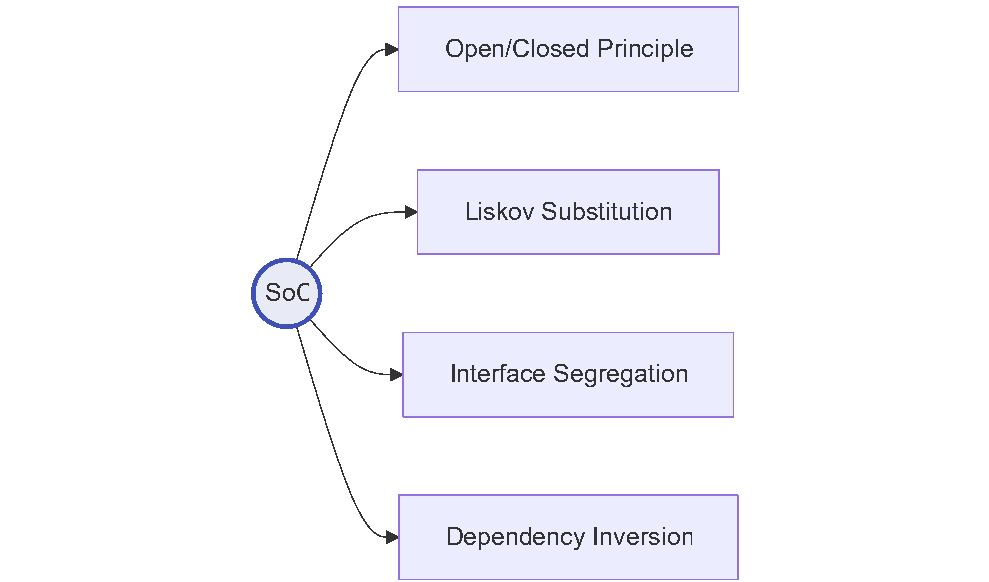

- **Open/Closed Principle (OCP):** Ao separar a preocupação de "orquestração de pagamento" da preocupação de "método específico de débito", você pode adicionar novos provedores (Pix, Stripe, Boleto) estendendo o sistema, sem modificar o núcleo existente.
- **Interface Segregation Principle (ISP):** Não force uma tela de visualização a depender de interfaces que contêm métodos administrativos ou de persistência profunda. Interfaces enxutas respeitam as preocupações específicas de cada consumidor.
- **Dependency Inversion Principle (DIP):** É o mecanismo que viabiliza o SoC na prática: módulos de alto nível (regras de negócio) não devem depender de módulos de baixo nível (drivers de rede ou SQL). Ambos devem depender de abstrações.

## 2.4 🛠 Estudo de Caso Prático: Quebrando o Acoplamento Nocivo

Vamos analisar um cenário comum de backend corporativo: o processamento e emissão de folhas de pagamento.

### ❌ O Cenário "Antes": Violação Simultânea de SoC e SRP

Neste exemplo em Python, a classe `PayrollProcessor` concentra cinco preocupações heterogêneas:

1. Conexão e consulta ao banco de dados relacional.
2. Cálculo das alíquotas legais de impostos (INSS/IRPF).
3. Geração e formatação de arquivo PDF.
4. Conexão de rede via SMTP para envio de holerite.

```python
# ❌ ANTES: God Class violando SoC e SRP com acoplamento catastrófico
import psycopg2
import smtplib
from reportlab.pdfgen import canvas # Dependência pesada de renderização de PDF

class PayrollProcessor:
    def __init__(self, db_connection_string: str, smtp_host: str):
        self.db_conn = psycopg2.connect(db_connection_string)
        self.smtp_host = smtp_host

    def process_employee_payroll(self, employee_id: int):
        # 1. Preocupação: Acesso a dados (Persistência)
        cursor = self.db_conn.cursor()
        cursor.execute("SELECT name, email, base_salary FROM employees WHERE id = %s", (employee_id,))
        row = cursor.fetchone()
        name, email, base_salary = row[0], row[1], float(row[2])

        # 2. Preocupação: Regra de Negócio / Legislação Tributária (Domínio)
        # Se a lei tributária mudar amanhã, temos que editar esta classe
        inss = base_salary * 0.11
        irpf = (base_salary - inss) * 0.15 if base_salary > 3000 else 0.0
        net_salary = base_salary - inss - irpf

        # 3. Preocupação: Geração de Mídia / Layout de Apresentação
        pdf_path = f"/tmp/holerite_{employee_id}.pdf"
        pdf = canvas.Canvas(pdf_path)
        pdf.drawString(100, 750, f"Holerite de Pagamento: {name}")
        pdf.drawString(100, 720, f"Salário Bruto: R$ {base_salary:.2f}")
        pdf.drawString(100, 700, f"Descontos: R$ {(inss + irpf):.2f}")
        pdf.drawString(100, 680, f"Líquido a Receber: R$ {net_salary:.2f}")
        pdf.save()

        # 4. Preocupação: Infraestrutura de Notificação / Transporte
        server = smtplib.SMTP(self.smtp_host, 587)
        server.sendmail("rh@empresa.com", email, f"Subject: Seu Holerite\n\nPDF gerado.")
        server.quit()
```

**Diagnóstico do Desastre Arquitetural:**

- **Razões para mudar:** Se o governo alterar a tabela do IRPF, alteramos esta classe. Se o design do holerite mudar, alteramos esta classe. Se o banco migrar de PostgreSQL para MongoDB, alteramos esta classe. Se mudarmos de SMTP para Amazon SES ou SendGrid, alteramos esta classe.
- **Testabilidade zero:** Testar se o cálculo de imposto está correto exige simular conexões de banco de dados, drivers de PDF e sockets SMTP.

### ✅ O Cenário "Depois": Orquestração Desacoplada e Coesa

Aplicando o SoC, fragmentamos as preocupações em camadas limpas, utilizando interfaces abstratas (DIP) e módulos coesos (SRP).

```python
# 1. CAMADA DE DOMÍNIO (Regras Puras e Imutáveis) - payroll/domain.py
from dataclasses import dataclass

@dataclass(frozen=True)
class TaxCalculationResult:
    base_salary: float
    inss_deduction: float
    irpf_deduction: float
    net_salary: float

class TaxPolicyEngine:
    """Alta coesão: existe exclusivamente para calcular tributos da folha."""
    @staticmethod
    def calculate(base_salary: float) -> TaxCalculationResult:
        inss = base_salary * 0.11
        taxable_base = base_salary - inss
        irpf = taxable_base * 0.15 if base_salary > 3000 else 0.0
        net = base_salary - inss - irpf

        return TaxCalculationResult(
            base_salary=base_salary,
            inss_deduction=inss,
            irpf_deduction=irpf,
            net_salary=net
        )

# 2. CONTRATOS DE FRONTEIRA (Portas / Interfaces Abstratas) - payroll/contracts.py
from abc import ABC, abstractmethod
from typing import Optional

class EmployeeRepository(ABC):
    @abstractmethod
    def get_employee_financial_data(self, employee_id: int) -> Optional[dict]:
        pass

class DocumentRenderer(ABC):
    @abstractmethod
    def render_payslip(self, employee_name: str, tax_result: TaxCalculationResult) -> bytes:
        pass

class NotificationDispatcher(ABC):
    @abstractmethod
    def send_document(self, recipient_email: str, subject: str, document_bytes: bytes) -> None:
        pass

# 3. CAMADA DE CASO DE USO / APLICAÇÃO (Orquestrador Puro) - payroll/use_case.py
class ProcessPayrollUseCase:
    """Preocupação: Coordenar o fluxo sem saber detalhes de bancos ou rede."""
    def __init__(
        self,
        repository: EmployeeRepository,
        renderer: DocumentRenderer,
        notifier: NotificationDispatcher
    ):
        self.repository = repository
        self.renderer = renderer
        self.notifier = notifier

    def execute(self, employee_id: int) -> None:
        employee = self.repository.get_employee_financial_data(employee_id)
        if not employee:
            raise ValueError("Colaborador não localizado.")

        # Executa a regra de negócio matemática
        tax_result = TaxPolicyEngine.calculate(employee["base_salary"])

        # Gera a mídia através da abstração
        document = self.renderer.render_payslip(employee["name"], tax_result)

        # Dispara notificação sem saber o protocolo de rede
        self.notifier.send_document(
            recipient_email=employee["email"],
            subject="Demonstrativo de Pagamento Mensal",
            document_bytes=document
        )
```

## 2.5 📌 Dicas e Observações Práticas de Arquitetura

- 🎯 **O "Teste dos Atores" de Martin:** Se você não tem certeza se uma classe cumpre o SRP, liste os grupos de pessoas na empresa que podem pedir alterações nela. Se o CFO (Financeiro) e o CMO (Marketing) puderem solicitar mudanças na mesma classe, suas preocupações estão fundidas.
- ⚖ **Coesão Lógica vs. Coesão Funcional:** Evite criar classes chamadas `CommonUtils`, `Helpers` ou `Misc`. Elas costumam ter baixa coesão lógica e viram verdadeiras "lixeiras arquiteturais" onde desenvolvedores escondem código que não souberam classificar.
- 🔄 **Dependa de Interfaces, não de Concreções:** Observe que no exemplo refatorado, o `ProcessPayrollUseCase` não tem ideia de que o PDF é gerado com a biblioteca ReportLab ou se o e-mail usa SMTP. Se amanhã o PDF for gerado por uma API em Rust ou o e-mail for trocado pelo WhatsApp, **o caso de uso e a regra de negócio permanecem intocados**.

# Capítulo 3: O Impacto do SoC nas Arquiteturas de Referência

> *"A good architecture maximizes the number of decisions not made."*
>
> — **Robert C. Martin (Uncle Bob)**, *Clean Architecture*

## 3.1 🏛 A Evolução Arquitetural como Busca Contínua por Fronteiras

A história do design de software pode ser lida como uma corrida contra o acoplamento descontrolado. À medida que os sistemas migraram de scripts utilitários para ecossistemas distribuídos, a necessidade de isolar preocupações gerou sucessivas **arquiteturas de referência**.

Uma arquitetura de referência não surge no vácuo acadêmico; ela é uma resposta padronizada a uma dor recorrente da indústria: o **colapso da manutenibilidade** quando código de apresentação, regras de negócio e infraestrutura se fundem.

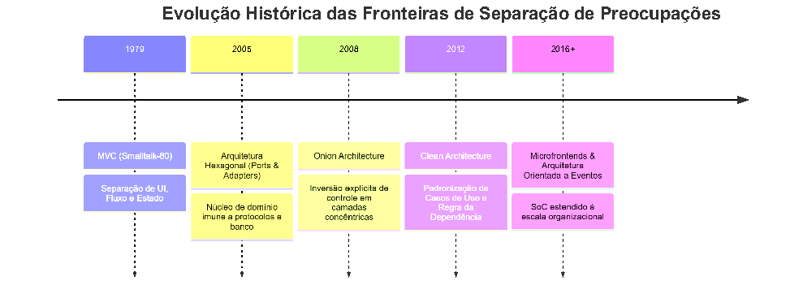

## 3.2 🔄 O Ponto de Partida: Model-View-Controller (MVC)

Concebido originalmente por **Trygve Reenskaug** na Xerox PARC (1979) para interfaces desktop em Smalltalk e posteriormente adaptado para a web (Ruby on Rails, Spring MVC, Django), o **MVC** foi o primeiro padrão generalizado a estabelecer fronteiras formais de responsabilidade.

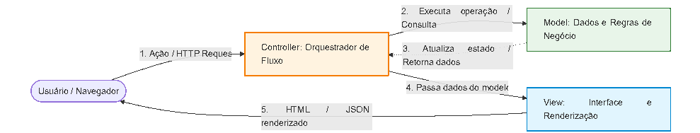

### As Preocupações no MVC:

1. **Model (Modelo):** Representa o estado, as regras de validação de dados e a persistência. Não conhece elementos gráficos, HTML ou cabeçalhos de rede.
2. **View (Visão):** Preocupa-se exclusivamente com a representação visual (HTML, CSS, templates, JSON em APIs). Não deve calcular juros nem disparar mutações de banco por conta própria.
3. **Controller (Controlador):** O intermediário. Preocupa-se em capturar o evento ou requisição de entrada, interpretar os parâmetros e direcionar a chamada para o Model correto, repassando o resultado à View adequada.

### O Anti-Padrão Clássico: *Fat Controller* (Controlador Gordo)

O maior sintoma de falha no MVC ocorre quando desenvolvedores delegam aos Controllers a execução direta de regras corporativas complexas ou comandos de persistência. O Controller passa a ter centenas de linhas de lógica de negócio, transformando-se em um gargalo impossível de testar sem simular requisições completas.

## 3.3 🔌 Arquitetura Hexagonal (Ports & Adapters)

Proposta por **Alistair Cockburn** em 2005, a **Arquitetura Hexagonal** surgiu para resolver uma fraqueza clássica das arquiteturas em camadas tradicionais: a tendência da lógica de negócio depender diretamente do banco de dados relacional.

A premissa central é direta: **o núcleo da aplicação (Domínio) deve ser agnóstico quanto à forma de ser consumido e quanto à forma de persistir dados.**

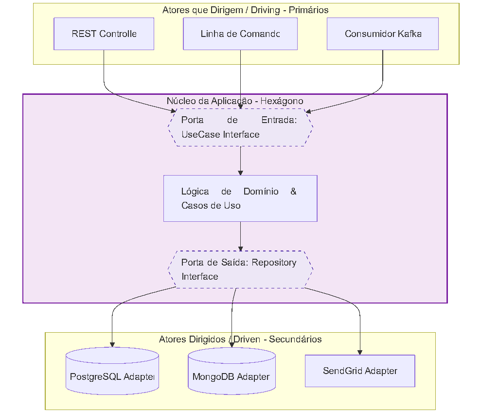

### Como o SoC se Manifesta:

- **Portas (Ports):** São interfaces (contratos) definidos no interior da aplicação. Estabelecem **o que** o sistema precisa, sem especificar **como** será feito.
- **Adaptadores (Adapters):** São os componentes de infraestrutura que convertem sinais externos para os contratos do sistema (adaptadores primários, ex: Express/FastAPI) ou convertem as ordens do sistema em chamadas concretas de infraestrutura (adaptadores secundários, ex: queries SQL, chamadas de API externa).
- **Benefício Operacional:** Substituir o PostgreSQL por DynamoDB exige reescrever unicamente o adaptador de banco. O núcleo de domínio permanece intacto e funcional.

## 3.4 🧅 Clean Architecture: A Regra da Dependência

Criada por **Robert C. Martin**, a *Clean Architecture* consolida os princípios do Hexagonal, Onion Architecture e Screaming Architecture em um modelo de círculos concêntricos governados por uma lei inflexível: **A Regra da Dependência**.

> **A Regra da Dependência:**
>
> O código-fonte só pode apontar **para dentro**. Nada em um círculo interno pode saber absolutamente nada sobre o que existe em um círculo externo.

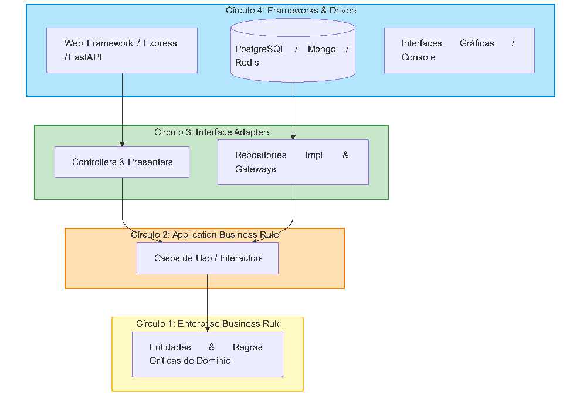

- **Entidades:** Encapsulam regras de negócio de larga escala (ex: cálculo de juros compostos, validação de CPF/CNPJ). São as menos propensas a mudar por motivos técnicos.
- **Casos de Uso:** Encapsulam os fluxos operacionais específicos da aplicação (ex: `TransferirFundosUseCase`, `CancelarMatriculaUseCase`). Orquestram as entidades sem conhecer a tecnologia de banco ou tela.
- **Adaptadores de Interface:** Traduzem os dados de entidades e casos de uso para o formato exigido por agentes externos (ex: DTOs, Serializers, Presenters).
- **Frameworks & Drivers:** A camada mais volátil e descartável. Onde vivem frameworks web, ORMs e drivers de hardware.

## 3.5 🧩 Microfrontends: O SoC na Camada Visual e Organizacional

Por muito tempo, acreditou-se que a Separação de Preocupações se aplicava apenas ao backend, enquanto o frontend podia ser mantido como uma aplicação única e monolítica. Com a expansão das Single Page Applications (SPAs) corporativas, esses monolitos de frontend tornaram-se difíceis de manter e compilar.

A arquitetura de **Microfrontends** estende o SoC horizontal e verticalmente:

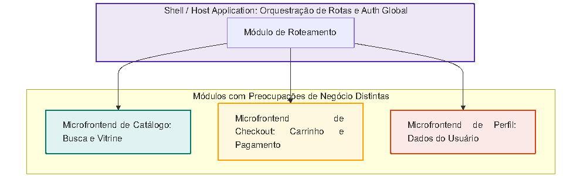

### Preocupações no Frontend:

1. **Vertical por Domínio de Negócio:** O time responsável por checkout opera e faz deploy do seu próprio microfrontend, sem depender do time responsável pelo catálogo de produtos.
2. **Horizontal por Camada Técnica:** Dentro de cada microfrontend, mantém-se a separação clássica:

- **Componentes de Apresentação (*Presentational/Dumb*):** Recebem props e renderizam JSX/HTML, sem chamadas de rede diretas.
- **Hooks/Controllers (*Smart Containers*):** Gerenciam estado, mutações e chamadas assíncronas.
- **Clientes de API/Serviços:** Gerenciam comunicação HTTP, cache e tokens.

## 3.6 ⚖ Matriz Comparativa das Abordagens

| **Arquitetura** | **Foco Primário de Separação** | **Mecanismo de Isolamento** | **Maior Risco de Violação** |
|---|---|---|---|
| **MVC** | Interface de usuário vs. Lógica vs. Navegação | Divisão em 3 papéis funcionais | Controladores sobrecarregados (*Fat Controllers*) |
| **Hexagonal** | Aplicação central vs. Infraestrutura/IO externo | Portas (Interfaces) e Adaptadores | Adaptadores que vazam tipos nativos de bibliotecas para dentro do core |
| **Clean Arch** | Estabilidade de regras vs. Volatilidade de frameworks | Camadas concêntricas e Regra da Dependência | Criação excessiva de DTOs e mapeadores (*Boilerplate Hell*) |
| **Microfrontends** | Domínios de negócio no navegador | Sub-aplicações independentes em tempo de execução | Compartilhamento acidental de estado global e dependências duplicadas |

## 3.7 📌 Dicas e Observações Práticas

- ⚠ **Atenção aos Mapeadores de Dados (Mappers):** Ao implementar Clean Architecture ou Hexagonal, resista à tentação de reutilizar as entidades do seu ORM (ex: classes anotadas com `@Entity`) nos seus Casos de Uso. Criar um objeto de domínio puro exige mapeamento extra, mas é a única barreira que impede que alterações de schema de banco contaminem a regra de negócio.
- 🎯 **Arquitetura deve emergir da complexidade, não do dogma:** Adotar Clean Architecture completa com 4 camadas para um CRUD de cadastro de endereço é desperdício de tempo e esforço. Utilize o padrão adequado à complexidade e ao ciclo de vida esperado para o sistema.

# Capítulo 4: Efeitos Colaterais, Limites Práticos e a Armadilha do *Overengineering*

> *"Complexity is the root cause of the vast majority of software problems."*
>
> — **John Ousterhout**, *A Philosophy of Software Design*

## 4.1 ⚠ A Lei dos Rendimentos Decrescentes no Design de Software

A Separação de Preocupações é frequentemente ensinada como uma virtude absoluta: quanto mais você separar, melhor será seu código. Na prática da engenharia de produção, essa visão dogmática é financeiramente e operacionalmente perigosa.

Isolar preocupações não é gratuito. Cada fronteira arquitetural que você introduz exige uma taxa de pedágio paga em:

- **Taxa de Indireção:** Mais classes intermediárias, mais saltos de chamada de método e maior esforço para rastrear o fluxo de execução.
- **Carga de Tradução:** Conversores, *mappers*, DTOs e adaptadores para transformar dados entre fronteiras.
- **Complexidade Acidental:** Dificuldades geradas pela própria arquitetura escolhida, e não pelo problema de negócio real.

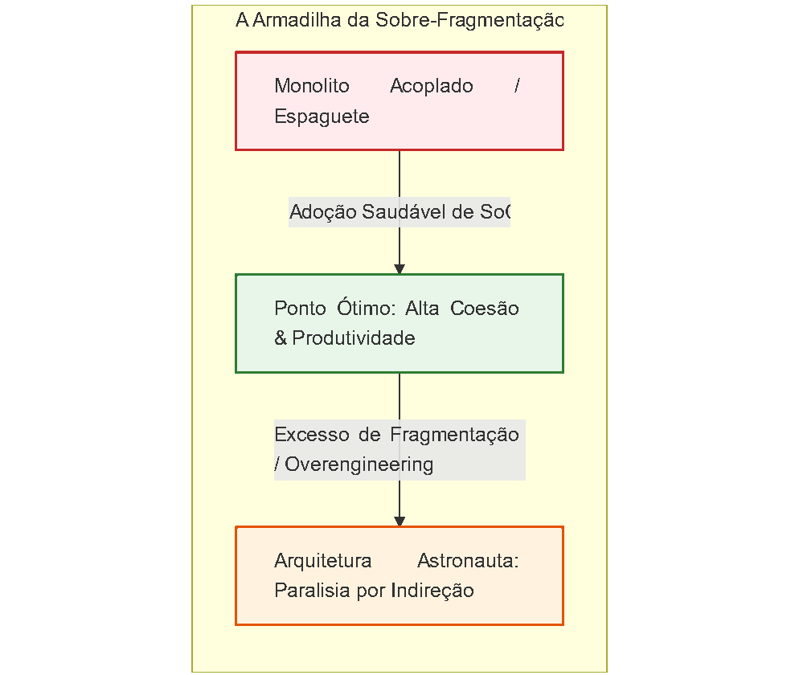

Quando o custo de manter as barreiras entre as camadas supera o valor comercial das mudanças que elas protegem, o SoC deixa de ser uma solução e torna-se o principal gargalo do projeto.

## 4.2 🌪 As Patologias Comuns da Separação Excessiva

Quando equipes aplicam padrões como Hexagonal ou Clean Architecture de forma cega a problemas triviais, surgem padrões degenerativos bem conhecidos na literatura técnica:

### 1. A Síndrome do "Passa-Prato" (*Pass-Through Layers*)

Ocorre quando uma requisição atravessa quatro ou cinco camadas sem que nenhuma transformação, cálculo ou validação real aconteça.

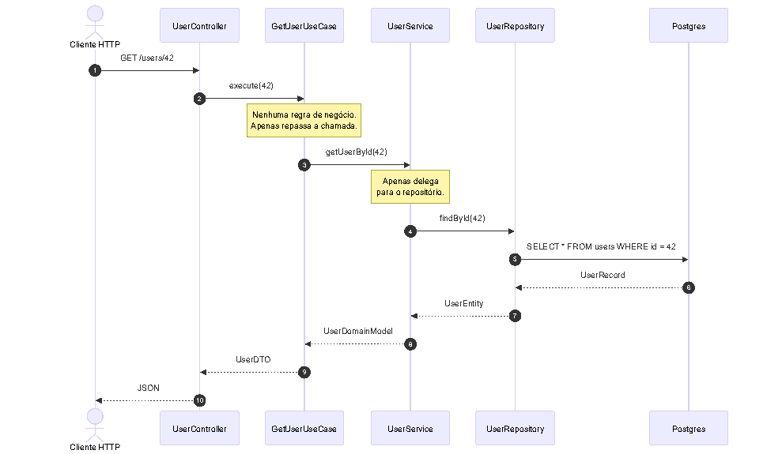

Neste cenário, para adicionar um simples campo booleano `is_active`, o engenheiro precisa alterar:

1. A tabela no banco de dados.
2. A entidade do ORM.
3. O modelo de domínio puro.
4. O DTO de saída do caso de uso.
5. O DTO/ViewModel do controlador.
6. Quatro métodos mapeadores em arquivos diferentes.

Isso não é manutenibilidade; é **fricção burocrática autoprovocada**.

### 2. Fragmentação Prematura (*Shotgun Surgery*)

Se você dividir o código em módulos granulares demais antes de entender os eixos reais de mudança do negócio, qualquer modificação trivial de requisito forçará você a tocar em dezenas de arquivos espalhados pelo repositório. O SoC mal posicionado destrói a coesão espacial: o que deveria estar junto fica artificialmente separado.

### 3. Proliferação de Mapeadores e Alocação Inútil de Memória

A conversão exaustiva de `Entity -> DomainModel -> UseCaseResult -> ViewModel -> JSON` em operações de leitura pesada consome ciclos de CPU e aloca gigabytes de objetos temporários na memória (*garbage collector pressure*), degradando o desempenho sem entregar ganho de segurança de tipos correspondente.

## 4.3 🔍 Identificando o Overengineering: Checklist de Diagnóstico

Como saber se a sua aplicação sofreu uma "overdose de arquitetura"? Responda às seguintes perguntas objetivas:

> **O sistema é um CRUD disfarçado de Domínio Rico?** Mais de 80% dos seus casos de uso apenas leem ou salvam registros sem executar nenhuma fórmula, política ou validação cruzada? **Quantas interfaces possuem exatamente UMA única implementação?** Se você tem 40 interfaces com sufixo `Impl` (`UserService` -&gt; `UserServiceImpl`, `PaymentService` -&gt; `PaymentServiceImpl`) e nunca haverá um segundo provedor, essas interfaces são apenas burocracia de digitação. **Qual é o tempo de integração de um desenvolvedor júnior?** Ele leva duas semanas apenas para entender onde criar uma rota simples porque precisa navegar por 9 diretórios antes de escrever 3 linhas de lógica? **A taxa de indireção é legível no stack trace?** Ao ocorrer um erro em produção, a pilha de exceção tem mais de 45 quadros de chamadas intermediárias que não fazem nada além de repassar argumentos?

Se a resposta for "sim" para a maioria dessas perguntas, a arquitetura está trabalhando contra a equipe, não a favor dela.

## 4.4 🛠 Estudo de Caso: A Refatoração Reversa (Simplificando a Burocracia)

Vamos analisar um caso concreto em Go: uma busca simples por perfil de usuário.

### ❌ O Cenário Hiper-Fragmentado (Arquitetura Astronauta)

O código foi dividido em 4 camadas rígidas para buscar uma linha no banco:

```go
// ❌ OVERENGINEERING: 4 arquivos e interfaces para ler um perfil de usuário

// 1. repository/user_repo.go
type UserRepository interface {
    GetByID(ctx context.Context, id string) (*UserDBModel, error)
}

// 2. domain/user.go
type UserDomain struct {
    ID    string
    Email string
}

// 3. usecase/get_user.go
type GetUserUseCase struct {
    repo UserRepository
}
func (uc *GetUserUseCase) Execute(ctx context.Context, id string) (*UserDomain, error) {
    dbModel, err := uc.repo.GetByID(ctx, id)
    if err != nil {
        return nil, err
    }
    // Mapeamento puro sem nenhuma regra de negócio
    return &UserDomain{ID: dbModel.ID, Email: dbModel.Email}, nil
}

// 4. handler/user_handler.go
type UserHandler struct {
    uc *GetUserUseCase
}
func (h *UserHandler) ServeHTTP(w http.ResponseWriter, r *http.Request) {
    id := r.URL.Query().Get("id")
    user, _ := h.uc.Execute(r.Context(), id)
    json.NewEncoder(w).Encode(map[string]string{"id": user.ID, "email": user.Email})
}
```

**Problema:** Nenhuma regra existe aqui. A camada de domínio é um mero eco dos campos do banco de dados.

### ✅ O Cenário Pragmático (Vertical Slice / SoC por Linha de Negócio)

Se a operação é uma consulta simples sem regra de negócio complexa (*Read-heavy*), podemos aplicar o SoC agrupando por **funcionalidade vertical** (*Vertical Slice Architecture*), mantendo a persistência e o protocolo no mesmo arquivo focado:

```go
// ✅ PRAGMATISMO: Coesão vertical. Tudo o que muda junto, vive junto.
// features/get_user_profile.go

package features

import (
    "database/sql"
    "encoding/json"
    "net/http"
)

type GetUserProfileHandler struct {
    db *sql.DB
}

func NewGetUserProfileHandler(db *sql.DB) *GetUserProfileHandler {
    return &GetUserProfileHandler{db: db}
}

func (h *GetUserProfileHandler) ServeHTTP(w http.ResponseWriter, r *http.Request) {
    userID := r.URL.Query().Get("id")
    if userID == "" {
        http.Error(w, "ID obrigatório", http.StatusBadRequest)
        return
    }

    var email string
    err := h.db.QueryRowContext(r.Context(), "SELECT email FROM users WHERE id = $1", userID).Scan(&email)
    if err == sql.ErrNoRows {
        http.Error(w, "Usuário não encontrado", http.StatusNotFound)
        return
    } else if err != nil {
        http.Error(w, "Erro no servidor", http.StatusInternalServerError)
        return
    }

    w.Header().Set("Content-Type", "application/json")
    json.NewEncoder(w).Encode(map[string]string{
        "id":    userID,
        "email": email,
    })
}
```

**Por que isso não é código espaguete?**

- O código é **altamente coeso**: a rota, a consulta SQL específica e o JSON de retorno estão em um único arquivo de 40 linhas.
- Se a consulta precisar de um índice ou de um novo campo, você abre **um único arquivo**, faz a alteração e roda o teste.
- O SoC horizontal clássico (Clean/Hexagonal) deve ser reservado para **onde reside o valor de negócio** (ex: liquidação de ordens, cálculos fiscais, fluxo de estorno), não para consultas triviais.

## 4.5 📌 Dicas e Heurísticas Práticas de Equilíbrio

- ⏱ **A Regra de Três (Refatore no Terceiro Ponto de Uso):** Nunca crie uma camada de abstração genérica com base na suposição de que "no futuro precisaremos de suporte a múltiplos bancos ou múltiplos sistemas de mensageria". Deixe a duplicação ocorrer duas vezes; apenas na terceira ocorrência extraia uma abstração consolidada.
- 📦 **Prefira Coesão de Funcionalidade (*Slices*) a Camadas Técnicas Estritas:** Organize seu projeto primariamente por domínios de negócio (`/billing`, `/catalog`, `/identity`) e só depois, internamente em cada domínio, decida se aquela fatia específica necessita de 3 camadas ou de um único arquivo enxuto.
- 🛡 **YAGNI (*You Aren't Gonna Need It*):** O custo de refatorar um código direto para uma arquitetura em camadas quando o sistema crescer é significativamente menor do que o custo acumulado de navegar em uma arquitetura superdimensionada que nunca precisou existir.

# Capítulo 5: Refatoração Prática de Frontend: De Componentes Monolíticos a Camadas Desacopladas

> *"Components that do too much end up doing nothing well: they are hard to read, impossible to test in isolation, and painful to reuse."*
>
> — **Dan Abramov**

## 5.1 🖥 A Ilusão da Componentização Moderna

Com a ascensão de bibliotecas baseadas em componentes reativos como React, Vue e Svelte, a promessa inicial era simples: interfaces seriam pequenos blocos de Lego isolados e reutilizáveis.

Na prática cotidiana das equipes de produto, no entanto, surgiu uma patologia comum: o **Componente Monolítico** (ou *God Component*). Em vez de páginas inteiras emaranhadas, passamos a ter componentes individuais de 600 linhas que concentram:

- Disparo de requisições de rede (`fetch` / `axios`).
- Tratamento de erros de transporte HTTP e tokens expirados.
- Regras matemáticas de negócio e validação de formulários.
- Controle de múltiplos estados locais e sincronizações assíncronas (`useEffect`).
- Estrutura de marcação HTML, estilização visual e lógica de acessibilidade.

O problema central aqui é a confusão entre **separação de tecnologias** (antigamente: arquivos separados para HTML, CSS e JS) e **Separação de Responsabilidades** (separação de responsabilidades conceituais). Colocar marcação, estilo e lógica no mesmo arquivo via JSX ou SFC não viola o SoC por si só; a violação ocorre quando misturamos **a camada de transporte de dados e regras de negócio com a árvore de renderização da interface visual**.

## 5.2 🏗 A Anatomia das Camadas no Frontend

Para aplicar o SoC na camada visual de forma sustentável, dividimos o ciclo de vida do cliente em quatro preocupações essenciais:

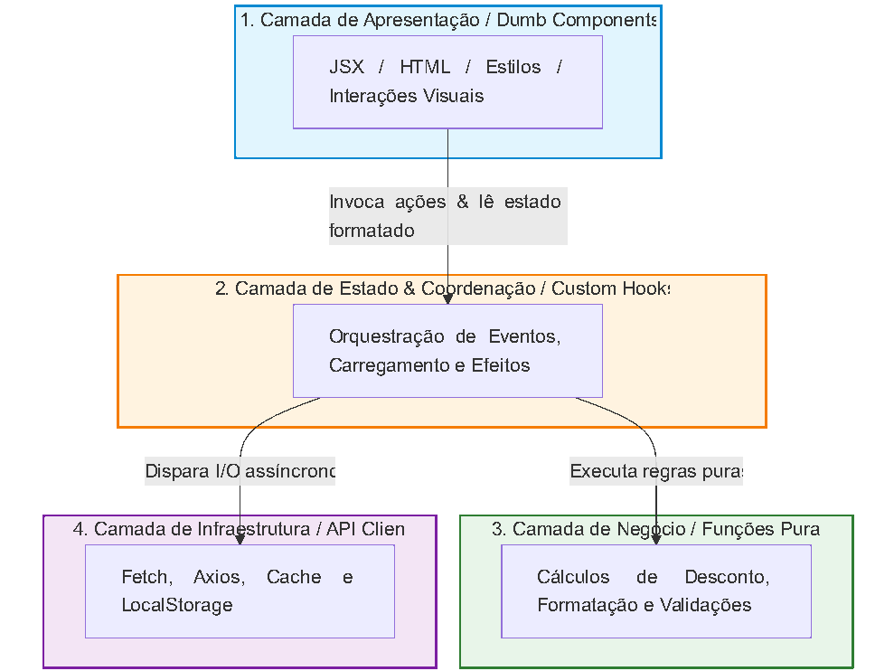

1. **Apresentação Pura (*Presentational/Dumb*):** Recebe dados prontos via propriedades (*props*) e emite callbacks de eventos nativos (`onClick`, `onSelect`). Não sabe de onde o dado veio nem como ele será persistido. Pode ser renderizada no Storybook ou testada visualmente sem precisar de mocks complexos de rede.
2. **Coordenação (*Custom Hooks / Controllers*):** Gerencia estados intermediários (`isLoading`, `error`, `data`), orquestra chamadas assíncronas e expõe uma API limpa para a interface.
3. **Regras de Negócio e Validação (*Domain/Logic*):** Funções JavaScript/TypeScript puras, sem referências a APIs de navegador (como `window` ou `document`) e sem dependências do framework de renderização.
4. **Infraestrutura (*Data Access/HTTP*):** Clientes de rede encapsulados, responsáveis por cabeçalhos, tratamento de URL base, serialização e renovação de credenciais.

## 5.3 🛠 Estudo de Caso Prático: O Widget de Cobrança e Pagamento

Vamos analisar um caso comum em sistemas SaaS: um formulário de alteração de plano de assinatura com cálculo dinâmico de taxa e chamada a um gateway de pagamento.

### ❌ O Cenário "Antes": O Componente Monolítico (God Component)

Neste arquivo React em TypeScript, todas as quatro preocupações convivem no mesmo corpo de função:

```typescript
// ❌ ANTES: subscription-modal.tsx (Monolito Acoplado)
import React, { useState, useEffect } from "react";
import axios from "axios";

export const SubscriptionModal: React.FC<{ userId: string }> = ({ userId }) => {
  const [plan, setPlan] = useState<"starter" | "pro" | "enterprise">("starter");
  const [usersCount, setUsersCount] = useState<number>(1);
  const [coupon, setCoupon] = useState<string>("");
  const [total, setTotal] = useState<number>(0);
  const [loading, setLoading] = useState<boolean>(false);
  const [errorMessage, setErrorMessage] = useState<string | null>(null);

  // 1. Preocupação: Regra de Negócio / Domínio misturada ao ciclo de vida do componente
  useEffect(() => {
    let basePrice = plan === "starter" ? 29 : plan === "pro" ? 79 : 199;
    let computed = basePrice * usersCount;

    // Regra de cupom codificada diretamente dentro do hook da UI
    if (coupon.trim().toUpperCase() === "PROMO10" && computed > 100) {
      computed = computed * 0.90; // 10% de desconto
    }

    setTotal(computed);
  }, [plan, usersCount, coupon]);

  // 2. Preocupação: Infraestrutura de Rede, Transporte HTTP e Tratamento de Erros
  const handleCheckout = async () => {
    setLoading(true);
    setErrorMessage(null);
    try {
      const token = localStorage.getItem("auth_token");
      const response = await axios.post(
        "https://api.empresa.com/v1/billing/subscriptions",
        {
          targetUserId: userId,
          selectedPlan: plan,
          seats: usersCount,
          appliedCoupon: coupon,
          finalAmount: total,
        },
        {
          headers: { Authorization: `Bearer ${token}` }
        }
      );

      if (response.data.status === "ACTIVE") {
        alert("Assinatura atualizada com sucesso!");
      }
    } catch (err: any) {
      setErrorMessage(err.response?.data?.message || "Falha ao processar assinatura.");
    } finally {
      setLoading(false);
    }
  };

  // 3. Preocupação: Estrutura Visual, Acessibilidade e Layout (JSX)
  return (
    <div className="modal-overlay">
      <div className="modal-box">
        <h2>Atualizar Assinatura</h2>

        {errorMessage && <div className="alert-box">{errorMessage}</div>}

        <label>Plano:</label>
        <select value={plan} onChange={(e: any) => setPlan(e.target.value)}>
          <option value="starter">Starter (R$ 29/usuário)</option>
          <option value="pro">Pro (R$ 79/usuário)</option>
          <option value="enterprise">Enterprise (R$ 199/usuário)</option>
        </select>

        <label>Quantidade de Usuários:</label>
        <input
          type="number"
          min="1"
          value={usersCount}
          onChange={(e) => setUsersCount(Math.max(1, parseInt(e.target.value) || 1))}
        />

        <label>Cupom de Desconto:</label>
        <input
          type="text"
          value={coupon}
          onChange={(e) => setCoupon(e.target.value)}
          placeholder="Ex: PROMO10"
        />

        <div className="total-display">
          <strong>Total a pagar:</strong> R$ {total.toFixed(2)}
        </div>

        <button onClick={handleCheckout} disabled={loading}>
          {loading ? "Processando..." : "Confirmar Assinatura"}
        </button>
      </div>
    </div>
  );
};
```

**Por que esta estrutura degrada a equipe rapidamente?**

1. **Inviável para testes automatizados unitários:** Para verificar se o cupom `PROMO10` concede o desconto correto, você precisa renderizar o DOM virtual, simular eventos de teclado nos `<input>` e mockar o módulo de rede do Axios.
2. **Impossível de reutilizar:** Se a tela mobile ou uma página de *landing page* precisar da mesma calculadora de preços, o código precisará ser copiado e colado.
3. **Alto acoplamento com o ambiente:** O componente quebra imediatamente se executado em um ambiente sem `localStorage` (como em testes de SSR no Next.js).

### ✅ O Cenário "Depois": Decomposição em Quatro Camadas Coesas

Vamos refatorar o monolito extraindo o cálculo matemático, o acesso à API e o estado em módulos independentes.

#### Passo 1: O Domínio Puro (Sem React, sem Axios)

```typescript
// 1. domain/pricing.ts
export type PlanTier = "starter" | "pro" | "enterprise";

const BASE_PRICES: Record<PlanTier, number> = {
  starter: 29,
  pro: 79,
  enterprise: 199,
};

export class PricingCalculator {
  public static calculateTotal(plan: PlanTier, seats: number, couponCode: string): number {
    const rawTotal = (BASE_PRICES[plan] || 0) * Math.max(1, seats);
    const normalizedCoupon = couponCode.trim().toUpperCase();

    if (normalizedCoupon === "PROMO10" && rawTotal > 100) {
      return rawTotal * 0.90;
    }

    return rawTotal;
  }
}
```

#### Passo 2: O Cliente de Infraestrutura

```typescript
// 2. services/billing-api.ts
export interface CreateSubscriptionPayload {
  targetUserId: string;
  selectedPlan: PlanTier;
  seats: number;
  appliedCoupon: string;
  finalAmount: number;
}

export class BillingApiService {
  private static readonly BASE_URL = "https://api.empresa.com/v1";

  public static async createSubscription(payload: CreateSubscriptionPayload): Promise<{status: string }> {
    const token = typeof window !== "undefined" ? localStorage.getItem("auth_token") : null;

    const response = await fetch(`${this.BASE_URL}/billing/subscriptions`, {
      method: "POST",
      headers: {
        "Content-Type": "application/json",
        ...(token ? { Authorization: `Bearer ${token}` } : {}),
      },
      body: JSON.stringify(payload),
    });

    if (!response.ok) {
      const errorBody = await response.json().catch(() => ({}));
      throw new Error(errorBody.message || "Falha ao processar assinatura.");
    }

    return response.json();
  }
}
```

#### Passo 3: O Orquestrador de Estado (Custom Hook)

```typescript
// 3. hooks/useSubscriptionCheckout.ts
import { useState, useMemo } from "react";
import { PricingCalculator, PlanTier } from "../domain/pricing";
import { BillingApiService } from "../services/billing-api";

export function useSubscriptionCheckout(userId: string, onSuccess?: () => void) {
  const [plan, setPlan] = useState<PlanTier>("starter");
  const [seats, setSeats] = useState<number>(1);
  const [coupon, setCoupon] = useState<string>("");
  const [isLoading, setIsLoading] = useState<boolean>(false);
  const [errorMessage, setErrorMessage] = useState<string | null>(null);

  // O cálculo agora é uma derivação de estado pura, sem useEffect
  const totalAmount = useMemo(() => {
    return PricingCalculator.calculateTotal(plan, seats, coupon);
  }, [plan, seats, coupon]);

  const submitSubscription = async () => {
    setIsLoading(true);
    setErrorMessage(null);

    try {
      const result = await BillingApiService.createSubscription({
        targetUserId: userId,
        selectedPlan: plan,
        seats,
        appliedCoupon: coupon,
        finalAmount: totalAmount,
      });

      if (result.status === "ACTIVE" && onSuccess) {
        onSuccess();
      }
    } catch (err: unknown) {
      const message = err instanceof Error ? err.message : "Erro desconhecido na requisição.";
      setErrorMessage(message);
    } finally {
      setIsLoading(false);
    }
  };

  return {
    state: { plan, seats, coupon, totalAmount, isLoading, errorMessage },
    actions: { setPlan, setSeats, setCoupon, submitSubscription },
  };
}
```

#### Passo 4: A View Pura (Dumb / Presentational Component)

```tsx
// 4. components/SubscriptionModalView.tsx
import React from "react";
import { PlanTier } from "../domain/pricing";

interface SubscriptionModalViewProps {
  plan: PlanTier;
  seats: number;
  coupon: string;
  totalAmount: number;
  isLoading: boolean;
  errorMessage: string | null;
  onPlanChange: (plan: PlanTier) => void;
  onSeatsChange: (seats: number) => void;
  onCouponChange: (coupon: string) => void;
  onSubmit: () => void;
}

export const SubscriptionModalView: React.FC<SubscriptionModalViewProps> = ({
  plan,
  seats,
  coupon,
  totalAmount,
  isLoading,
  errorMessage,
  onPlanChange,
  onSeatsChange,
  onCouponChange,
  onSubmit,
}) => (
  <div className="modal-overlay">
    <div className="modal-box">
      <h2>Atualizar Assinatura</h2>

      {errorMessage && <div className="alert-box">{errorMessage}</div>}

      <label htmlFor="plan-select">Plano:</label>
      <select
        id="plan-select"
        value={plan}
        onChange={(e) => onPlanChange(e.target.value as PlanTier)}
      >
        <option value="starter">Starter (R$ 29/usuário)</option>
        <option value="pro">Pro (R$ 79/usuário)</option>
        <option value="enterprise">Enterprise (R$ 199/usuário)</option>
      </select>

      <label htmlFor="seats-input">Quantidade de Usuários:</label>
      <input
        id="seats-input"
        type="number"
        min="1"
        value={seats}
        onChange={(e) => onSeatsChange(Math.max(1, parseInt(e.target.value, 10) || 1))}
      />

      <label htmlFor="coupon-input">Cupom de Desconto:</label>
      <input
        id="coupon-input"
        type="text"
        value={coupon}
        onChange={(e) => onCouponChange(e.target.value)}
        placeholder="Ex: PROMO10"
      />

      <div className="total-display">
        <strong>Total a pagar:</strong> R$ {totalAmount.toFixed(2)}
      </div>

      <button onClick={onSubmit} disabled={isLoading}>
        {isLoading ? "Processando..." : "Confirmar Assinatura"}
      </button>
    </div>
  </div>
);
```

#### Passo 5: O Ponto de Composição (Container / Shell)

```tsx
// 5. containers/SubscriptionModalContainer.tsx
import React from "react";
import { useSubscriptionCheckout } from "../hooks/useSubscriptionCheckout";
import { SubscriptionModalView } from "../components/SubscriptionModalView";

export const SubscriptionModal: React.FC<{ userId: string }> = ({ userId }) => {
  const { state, actions } = useSubscriptionCheckout(userId, () => {
    alert("Assinatura atualizada com sucesso!");
  });

  return (
    <SubscriptionModalView
      plan={state.plan}
      seats={state.seats}
      coupon={state.coupon}
      totalAmount={state.totalAmount}
      isLoading={state.isLoading}
      errorMessage={state.errorMessage}
      onPlanChange={actions.setPlan}
      onSeatsChange={actions.setSeats}
      onCouponChange={actions.setCoupon}
      onSubmit={actions.submitSubscription}
    />
  );
};
```

## 5.4 ⚖ O Que Ganhamos com Essa Decomposição?

| **Aspecto** | **Antes (Monolito)** | **Depois (Desacoplado)** |
|---|---|---|
| **Teste de Regra de Negócio** | Exigia simulação de navegador e mocks de DOM/Axios (~450ms por teste). | Função pura testável com Jest/Vitest em menos de 2ms. |
| **Ambiente de Testes Visuais** | Impossível usar no Storybook sem interceptar chamadas HTTP globais. | Basta passar props estáticas para `SubscriptionModalView`. |
| **Custo de Migração de Framework** | Se migrar do React para Vue/Svelte, 100% do código precisaria ser reescrito. | As regras de cálculo e as chamadas de API (`pricing.ts` e `billing-` `api.ts`) continuam 100% idênticas. |
| **Rastreabilidade de Falhas** | Um erro de rendering pode congelar a regra de negócio. | Falhas de rede, bugs de cálculo e erros de layout ficam contidos em seus respectivos arquivos. |

## 5.5 📌 Dicas e Observações do Especialista Frontend

- 🚫 **Evite o excesso de `useEffect` para calcular dados derivados:** No código inicial, usamos `useEffect` para recalcular o total quando o plano mudava. Isso gera re-renderizações desnecessárias (*render waterfalls*). Sempre que um valor puder ser computado a partir de variáveis de estado existentes, utilize funções puras combinadas com `useMemo`.
- 🧪 **O Teste do Storybook:** Se você precisa de mais de 10 linhas de setup ou bibliotecas de mock de rede para conseguir exibir um componente visual em um catálogo de componentes, significa que a sua camada de apresentação ainda está acoplada à camada de infraestrutura.
- 📦 **Não crie arquivos demais para componentes banais:** Se um componente apenas renderiza um botão estilizado com um rótulo e um ícone, não crie 5 arquivos para ele. A separação em 4 camadas deve ser aplicada quando houver **coexistência real** de regras de negócio, dados de rede e interface.

# Capítulo 6: Refatoração Prática de Backend: Regra de Negócio, Persistência e Protocolo

> *"Make sure that business rules don't know about databases, UI, or frameworks. The center of your application is not the database. It is the use cases."*
>
> — **Robert C. Martin (Uncle Bob)**

## 6.1 🛑 A Patologia Clássica do Backend: O "Modelo Anêmico Ativo"

No ecossistema backend moderno — seja em Java com Spring, C# com .NET, Python com Django ou Node.js com Nest/TypeORM —, o vício arquitetural mais persistente é a fusão promíscua entre **transporte de rede**, **leitura/escrita em banco** e **regras corporativas críticas**.

Muitos desenvolvedores adotam o padrão *Active Record* ou estruturam seus serviços como meros repassadores de chamadas para ORMs. O resultado dessa abordagem é o surgimento de entidades anêmicas manipuladas por controladores que tomam decisões fiscais, abrem transações manuais e serializam JSON, tudo no mesmo bloco de código.

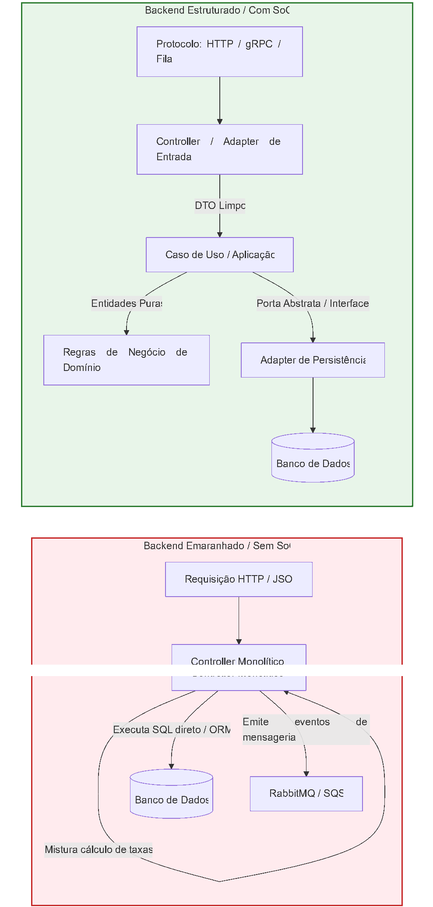

Quando esse emaranhamento ocorre, pequenas mudanças de infraestrutura (como substituir uma chave primária serial por UUID ou migrar de REST para mensageria assíncrona) forçam o time a reescrever e homologar novamente as regras contábeis do negócio.

## 6.2 🧩 As Três Fronteiras Fundamentais

Para blindar o backend contra volatilidade externa, isolamos o fluxo de processamento em três preocupações impermeáveis:

1. **Protocolo e Transporte (Adaptadores Primários):**
   - *Responsabilidade:* Interpretar verbos HTTP, cabeçalhos, rotas, códigos de status gRPC ou payloads de filas Kafka/RabbitMQ.
   - *Regra de Ouro:* Essa camada deve apenas validar o formato dos dados de entrada, passá-los para a camada de aplicação e serializar a resposta. Não toma decisões de negócio.
2. **Casos de Uso e Orquestração (Aplicação):**
   - *Responsabilidade:* Coordenar a sequência de passos necessária para cumprir uma tarefa do usuário.
   - *Regra de Ouro:* Busca entidades por meio de repositórios abstratos, delega os cálculos para os modelos de domínio e despacha notificações por meio de portas. Não conhece dialeto SQL, conexões TCP nem schemas de bibliotecas web.
3. **Regras de Negócio e Invariantes (Domínio Puro):**
   - *Responsabilidade:* Garantir que as regras inquebráveis do negócio continuem consistentes (ex: saldo não pode ficar negativo, desconto máximo de 20%, cancelamento só permitido em até 7 dias).
   - *Regra de Ouro:* Não possui anotações de ORM, não faz queries de rede e depende exclusivamente da linguagem base (POJOs/Dataclasses/Pydantic/Tipos puros).

## 6.3 🛠 Estudo de Caso Prático: Liberação de Empréstimo Financeiro

Analisemos uma funcionalidade bancária sensível: a avaliação e aprovação de uma solicitação de empréstimo consignado.

### ❌ O Cenário "Antes": O Serviço Centrado em Banco e Framework

Neste exemplo em TypeScript/Node.js, a classe `LoanController` orquestra o HTTP, executa verificações de crédito em SQL, calcula juros compostos e comita dados diretamente:

```typescript
// ❌ ANTES: Controller misturando protocolo, SQL direto, regras e integrações
import { Request, Response } from "express";
import { pool } from "../database/connection";
import axios from "axios";

export class LoanController {
  public static async applyForLoan(req: Request, res: Response) {
    // 1. Preocupação: Validação de Protocolo HTTP
    const { customerId, requestedAmount, installments } = req.body;
    if (!customerId || !requestedAmount || !installments) {
      return res.status(400).json({ error: "Parâmetros ausentes." });
    }

    try {
      // 2. Preocupação: Acesso a Dados / Persistência
      const clientQuery = await pool.query(
        "SELECT income, credit_score, has_default_history FROM customers WHERE id = $1",
        [customerId]
      );
      const customer = clientQuery.rows[0];
      if (!customer) {
        return res.status(404).json({ error: "Cliente inexistente." });
      }

      // 3. Preocupação: Regra de Negócio Crítica (Risco de Crédito)
      if (customer.has_default_history) {
        return res.status(422).json({ error: "Crédito recusado: histórico de inadimplência."});
      }

      const installmentValue = (requestedAmount * 1.05) / installments;
      const maxAllowedInstallment = customer.income * 0.30; // Margem consignável de 30%

      if (installmentValue > maxAllowedInstallment) {
        return res.status(422).json({ error: "Valor excede a margem legal consignável." });
      }

      // 4. Preocupação: Transação e Persistência Direta
      const insertLoan = await pool.query(
        "INSERT INTO loans (customer_id, amount, installments, monthly_value, status) VALUES ($1, $2, $3, $4, 'APPROVED') RETURNING id",
        [customerId, requestedAmount, installments, installmentValue]
      );

      // 5. Preocupação: Infraestrutura Externa (Disparo para o Banco Central)
      await axios.post("https://api.bacen.gov.br/v2/operations", {
        operationId: insertLoan.rows[0].id,
        amount: requestedAmount,
      });

      return res.status(201).json({
        loanId: insertLoan.rows[0].id,
        status: "APPROVED",
        monthlyValue: installmentValue,
      });
    } catch (err) {
      return res.status(500).json({ error: "Erro interno ao processar empréstimo." });
    }
  }
}
```

**Problemas Graves:**

- Se a auditoria exigir alterar o cálculo da taxa de 1.05 para uma fórmula exponencial de amortização, você precisa editar o arquivo do controlador HTTP.
- Impossível testar a margem de 30% sem rodar o PostgreSQL localmente e mockar o endpoint do Banco Central.
- Se a empresa decidir aceitar solicitações de empréstimo via mensageria RabbitMQ em vez de HTTP REST, toda a lógica de negócio terá de ser duplicada.

### ✅ O Cenário "Depois": Isolamento de Camadas com Inversão de Dependência

Vamos reorganizar a solução em três camadas autônomas.

#### 1. A Camada de Domínio Puro (Sem dependências externas)

```typescript
// domain/loan-policy.ts
export interface CustomerFinancialProfile {
  monthlyIncome: number;
  hasDefaultHistory: boolean;
}

export interface LoanProposal {
  amount: number;
  installments: number;
}

export class LoanUnderwritingPolicy {
  private static readonly INTEREST_RATE = 0.05; // 5% flat para o exemplo
  private static readonly MAX_INCOME_COMMITMENT_RATIO = 0.30; // Margem de 30%

  public static evaluate(profile: CustomerFinancialProfile, proposal: LoanProposal): {approved: boolean; monthlyValue: number; reason?: string } {
    if (profile.hasDefaultHistory) {
      return { approved: false, monthlyValue: 0, reason: "Histórico de inadimplência ativo."};
    }

    const totalToRepay = proposal.amount * (1 + this.INTEREST_RATE);
    const monthlyInstallment = totalToRepay / proposal.installments;
    const maxInstallmentAllowed = profile.monthlyIncome * this.MAX_INCOME_COMMITMENT_RATIO;

    if (monthlyInstallment > maxInstallmentAllowed) {
      return {
        approved: false,
        monthlyValue: monthlyInstallment,
        reason: `Parcela (R$ ${monthlyInstallment.toFixed(2)}) ultrapassa a margem legal consignável.`
      };
    }

    return { approved: true, monthlyValue: monthlyInstallment };
  }
}
```

#### 2. As Portas (Contratos Abstratos de Fronteira)

```typescript
// application/ports.ts
import { CustomerFinancialProfile, LoanProposal } from "../domain/loan-policy";

export interface CustomerRepository {
  getFinancialProfile(customerId: string): Promise<CustomerFinancialProfile | null>;
}

export interface LoanRepository {
  saveApprovedLoan(customerId: string, proposal: LoanProposal, monthlyValue: number): Promise<string>;
}

export interface RegulatoryNotifier {
  registerOperation(loanId: string, amount: number): Promise<void>;
}
```

#### 3. A Camada de Aplicação (Caso de Uso Orquestrador)

```typescript
// application/apply-loan-usecase.ts
import { LoanUnderwritingPolicy, LoanProposal } from "../domain/loan-policy";
import { CustomerRepository, LoanRepository, RegulatoryNotifier } from "./ports";

export interface ApplyLoanInput {
  customerId: string;
  amount: number;
  installments: number;
}

export interface ApplyLoanOutput {
  loanId?: string;
  status: "APPROVED" | "REJECTED";
  monthlyValue?: number;
  rejectionReason?: string;
}

export class ApplyLoanUseCase {
  constructor(
    private readonly customerRepo: CustomerRepository,
    private readonly loanRepo: LoanRepository,
    private readonly regulatorNotifier: RegulatoryNotifier
  ) {}

  public async execute(input: ApplyLoanInput): Promise<ApplyLoanOutput> {
    const profile = await this.customerRepo.getFinancialProfile(input.customerId);
    if (!profile) {
      throw new Error("CLIENT_NOT_FOUND");
    }

    const proposal: LoanProposal = { amount: input.amount, installments: input.installments };
    const evaluation = LoanUnderwritingPolicy.evaluate(profile, proposal);

    if (!evaluation.approved) {
      return {
        status: "REJECTED",
        rejectionReason: evaluation.reason,
      };
    }

    // Persistência blindada por trás da interface
    const loanId = await this.loanRepo.saveApprovedLoan(input.customerId, proposal, evaluation.monthlyValue);

    // Efeito colateral externo via contrato
    await this.regulatorNotifier.registerOperation(loanId, proposal.amount);

    return {
      loanId,
      status: "APPROVED",
      monthlyValue: evaluation.monthlyValue,
    };
  }
}
```

#### 4. A Camada de Protocolo (Controller Express)

```typescript
// infrastructure/http/loan-controller.ts
import { Request, Response } from "express";
import { ApplyLoanUseCase } from "../../application/apply-loan-usecase";

export class LoanHttpController {
  constructor(private readonly useCase: ApplyLoanUseCase) {}

  public async handle(req: Request, res: Response): Promise<Response> {
    const { customerId, requestedAmount, installments } = req.body;

    if (!customerId || !requestedAmount || !installments) {
      return res.status(400).json({ error: "Parâmetros obrigatórios ausentes." });
    }

    try {
      const result = await this.useCase.execute({
        customerId,
        amount: Number(requestedAmount),
        installments: Number(installments),
      });

      if (result.status === "REJECTED") {
        return res.status(422).json({ error: result.rejectionReason });
      }

      return res.status(201).json(result);
    } catch (err: any) {
      if (err.message === "CLIENT_NOT_FOUND") {
        return res.status(404).json({ error: "Cliente não encontrado." });
      }
      return res.status(500).json({ error: "Falha de processamento no servidor." });
    }
  }
}
```

## 6.4 🧪 O Ganho Imediato em Testabilidade

Ao separar as preocupações com rigor, a suite de testes unitários torna-se limpa, rápida e determinística:

```typescript
// tests/loan-policy.test.ts (Roda em 1 milissegundo, sem banco, sem HTTP)
import { LoanUnderwritingPolicy } from "../domain/loan-policy";

describe("LoanUnderwritingPolicy", () => {
  it("deve rejeitar empréstimo quando a parcela superar 30% da renda", () => {
    const profile = { monthlyIncome: 3000, hasDefaultHistory: false };
    const proposal = { amount: 10000, installments: 5 }; // Parcela bruta > R$ 2000

    const result = LoanUnderwritingPolicy.evaluate(profile, proposal);

    expect(result.approved).toBe(false);
    expect(result.reason).toContain("ultrapassa a margem legal consignável");
  });
});
```

## 6.5 📌 Dicas e Observações do Especialista Backend

- 🛑 **Nunca devolva entidades do ORM diretamente na resposta do Controller:** Retornar instâncias do TypeORM, Hibernate ou Prisma na rota HTTP vaza colunas internas do banco (como senhas com hash ou flags de controle de concorrência) e acopla a estrutura do banco ao contrato com o cliente. Sempre devolva DTOs explícitos.
- 📦 **Transações de Banco pertencem à Infraestrutura, mas quem decide a fronteira é a Aplicação:** Se o Caso de Uso precisa que duas gravações sejam atômicas, use o padrão *Unit of Work* exposto como uma interface abstrata, em vez de importar transações diretas do banco dentro do seu domínio.
- 🎯 **Mantenha o Domínio Agnóstico a Bibliotecas:** Se o seu arquivo de regras de negócio contém um `import` de pacote HTTP (Express, FastAPI, Axum) ou de banco (Mongoose, Sequelize, PyMongo), a fronteira arquitetural foi rompida.

# Capítulo 7: SoC na Era do Desenvolvimento Guiado por IA: *Context Windows*, Agentes Autônomos e Determinismo

> *"Large language models do not fail because they lack intelligence; they fail because unstructured human complexity exhausts their attention mechanisms."*
>
> — **Andrej Karpathy**

## 7.1 🤖 O Novo Paradigma: O Desenvolvedor como Arquiteto de Contexto

Com a consolidação de assistentes de codificação (como Gemini Code Assist, Claude Code e GitHub Copilot) e agentes autônomos baseados em LLMs, surgiu uma premissa ingênua no mercado: a de que a arquitetura de software perderia relevância. O raciocínio falho sugeria que, se a IA é capaz de ler e gerar milhares de linhas de código em segundos, a organização estrutural do projeto deixaria de importar.

A realidade prática dos times de engenharia provou exatamente o oposto: **a Separação de Preocupações nunca foi tão crucial na história da computação.**

Antes, o principal consumidor da arquitetura era o cérebro do desenvolvedor humano, limitado pela memória de trabalho (a famosa heurística de Miller dos 7±2 blocos de informação). Hoje, a arquitetura atende simultaneamente ao engenheiro e aos modelos de linguagem.

Quando um repositório é um monolito emaranhado (*spaghetti code*), a IA sofre das mesmas patologias cognitivas que um humano:

- **Alucinações estruturais:** A IA inventa parâmetros ou supõe comportamentos inexistentes porque o arquivo contém ruído irrelevante.
- **Perda de atenção no meio (*Lost in the Middle*):** Conforme o arquivo cresce, a atenção dos transformadores degrada nos trechos centrais.
- **Falta de determinismo:** Pequenas mudanças de prompt ou de contexto geram alterações imprevisíveis em regras de negócio críticas.

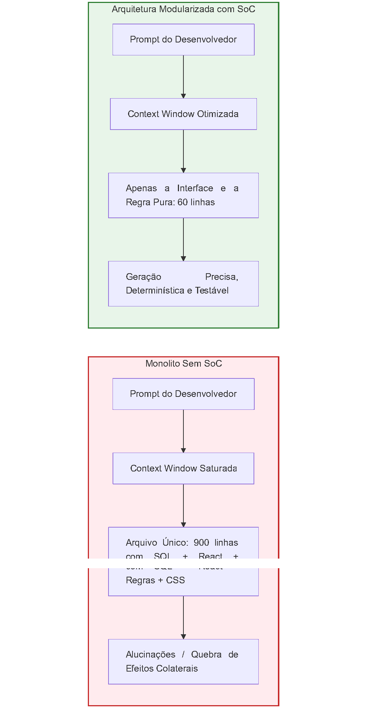

## 7.2 🪟 A Janela de Contexto (*Context Window*) como Recurso Escasso

Mesmo com janelas de contexto modernas que suportam centenas de milhares (ou milhões) de tokens, a **eficiência de recuperação** e a **precisão de raciocínio** dos modelos decaem com a sobrecarga de tokens irrelevantes (*token noise*).

### 1. A Relação Sinal-Ruído (*Signal-to-Noise Ratio*)

Ao pedir para uma IA adicionar uma regra tributária de ICMS:

- **Sem SoC:** Você passa um arquivo de 1.200 linhas contendo conexões de banco, manipulação de DOM, interceptadores HTTP e validações. 90% do conteúdo enviado é ruído. A probabilidade de o modelo introduzir regressões sutis ou perder nuances de cálculo é alta.
- **Com SoC:** Você alimenta o modelo exclusivamente com a classe de domínio puro `TaxCalculator.ts` (70 linhas) e sua respectiva suíte de testes. A densidade semântica do prompt é próxima de 100%.

### 2. Custo Financeiro e Latência

Modelos de linguagem faturam por milhão de tokens processados. Injetar arquivos gigantescos a cada iteração no editor multiplica a conta da API e eleva a latência de geração de 1 segundo para 10 a 15 segundos por resposta. A modularização do SoC funciona como um filtro de compressão semântica natural.

## 7.3 🕵️‍♂️ Agentes Autônomos e o Uso Preciso de Ferramentas (*Tool Use*)

A fronteira mais avançada do desenvolvimento com IA reside no uso de **agentes autônomos** (sistemas capazes de inspecionar diretórios, rodar linters, executar testes e fazer commits sozinhos).

Agentes dependem de mecanismos como *Tool Calling* / *Function Calling* para interagir com o ambiente externo. Aqui, a analogia com o SoC e a Arquitetura Hexagonal é direta:

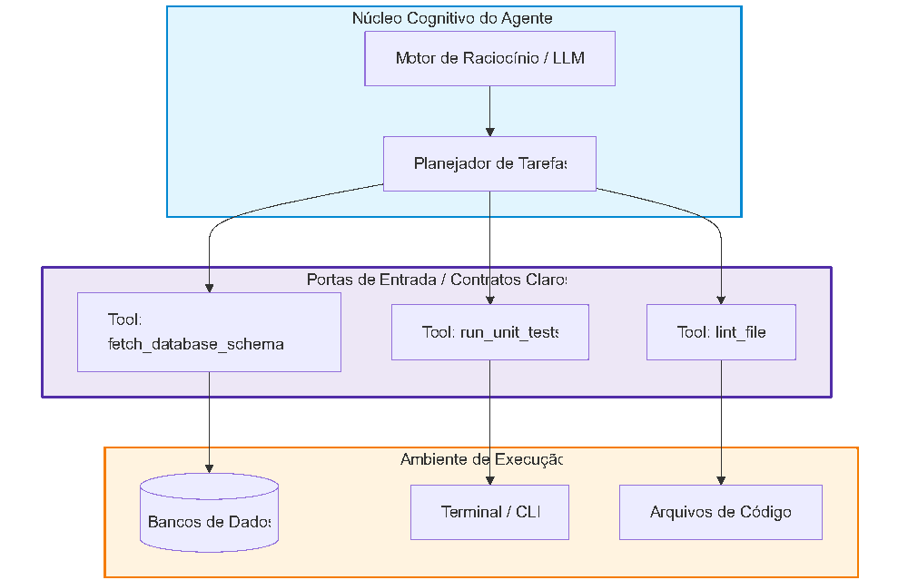

- **Interfaces Estritas Evitam Alucinação de Comandos:** Se o agente possui ferramentas com responsabilidades isoladas e tipos explícitos (ex: `executeDatabaseMigration` separada de `deployToProduction`), ele não se confunde sobre qual ação disparar.
- **Prevenção de Efeitos Colaterais Involuntários:** Se as regras de autorização estiverem emaranhadas com os scripts de migração de banco, o agente pode alterar permissões acidentalmente enquanto tentava apenas adicionar uma coluna em uma tabela.

## 7.4 🎯 Determinismo via Separação de Código Puro e Código Impuro

O maior desafio da engenharia assistida por IA é a **reprodutibilidade**. Modelos probabilísticos podem sugerir saídas ligeiramente diferentes a cada execução.

A Separação de Preocupações resolve esse dilema através da distinção clássica entre:

1. **Código com Efeito Colateral / Impuro (I/O):** Acessar redes, bancos de dados, relógio do sistema, arquivos locais.
2. **Código Lógico Puro (Funções Matemáticas / Domínio):** Recebe dados de entrada imutáveis e devolve um resultado sem tocar no mundo externo (f(x) = y).

```typescript
// 🧠 CÓDIGO PURO: O terreno perfeito para IA gerar código determinístico
// domain/interest.ts
export function calculateCompoundInterest(principal: number, annualRate: number, years: number): number {
  if (principal < 0 || annualRate < 0 || years < 0) {
    throw new Error("Parâmetros financeiros não podem ser negativos.");
  }
  return Number((principal * Math.pow(1 + annualRate, years)).toFixed(2));
}
```

Quando você isola o código puramente lógico do código impuro de infraestrutura, a IA consegue:

- Gerar **100% de cobertura de testes unitários** sem necessidade de *mocks*, *stubs* ou containers Docker.
- Provar formalmente a corretude da lógica através de testes de mutação e testes baseados em propriedades (*Property-Based Testing*).
- Refatorar algoritmos complexos sem correr o risco de abrir transações de banco vazias ou gerar vazamento de memória.

## 7.5 🛠 Tabela Comparativa: O Impacto de SoC no Desenvolvimento com IA

| **Aspecto da IA** | **Código Acoplado (Sem SoC)** | **Código Modular (Com SoC)** |
|---|---|---|
| **Taxa de Alucinação** | **Alta:** O modelo tenta adivinhar o comportamento de dependências ocultas misturadas no arquivo. | **Mínima:** O modelo recebe apenas o contrato e as assinaturas das interfaces. |
| **Consumo de Tokens** | Desperdiça 80% da janela com HTML, CSS e SQL em tarefas de lógica pura. | Envia estritamente os arquivos relevantes para a fatia da alteração. |
| **Qualidade dos Testes** | A IA gera testes frágeis que dependem de mocks excessivos de bibliotecas terceiras. | A IA gera testes unitários velozes focados na lógica invariante de domínio. |
| **Autonomia de Agentes** | O agente falha ao tentar aplicar patches (*diffs*) porque o arquivo sofre alterações caóticas. | O agente consegue ler, alterar e compilar módulos atômicos com segurança. |

## 7.6 📌 Dicas e Heurísticas para a Era da IA

- 📝 **Mantenha os arquivos enxutos (Menos de 200 linhas):** Arquivos curtos e coesos cabem perfeitamente nas melhores janelas de atenção das IAs e facilitam a aplicação de comandos de substituição pontual (*search/replace*).
- 📜 **Use Tipagem Estrita e Contratos Explícitos:** Linguagens fortemente tipadas (como TypeScript, Rust, Go ou Python com type hints) fornecem as "grades de proteção" que impedem o modelo de inventar atributos que não existem no schema do sistema.
- 🤖 **Prompt por Camada:** Ao solicitar uma nova funcionalidade para uma IA, não peça "Crie a tela e o backend de pagamentos". Divida o pedido em etapas sequenciais respeitando o SoC:

   1. *"Escreva a entidade de domínio e os testes unitários puros da regra de cálculo."*
   2. *"Defina a interface do repositório para persistir essa entidade."*
   3. *"Crie o caso de uso que orquestra a chamada."*
   4. *"Por fim, crie o componente de visualização que consome o estado."*

# 📚 Apêndice: Bibliografia Técnica Fundamental

As fundações teóricas e práticas deste livro baseiam-se nos clássicos consolidados da ciência da computação e da engenharia de software:

1. **Dijkstra, Edsger W.** (1974). *On the role of scientific thought*. EWD447. (Publicação seminal onde o termo "Separation of Concerns" foi cunhado formalmente).
2. **Parnas, David L.** (1972). *On the Criteria To Be Used in Decomposing Systems into Modules*. Communications of the ACM, 15(12), 1053–1058. (O fundamento do encapsulamento e ocultamento de informação).
3. **Martin, Robert C.** (2017). *Clean Architecture: A Craftsman's Guide to Software Structure and Design*. Prentice Hall. (Definição dos princípios SOLID, Regra da Dependência e arquiteturas concêntricas).
4. **Cockburn, Alistair.** (2005). *Hexagonal Architecture (Ports and Adapters)*. Alistair Cockburn's Design Patterns Anthology.
5. **Ousterhout, John.** (2018). *A Philosophy of Software Design*. Yaknyam Press. (Discussão sobre complexidade acidental, módulos profundos vs. módulos superficiais e o custo das abstrações).
6. **Evans, Eric.** (2003). *Domain-Driven Design: Tackling Complexity in the Heart of Software*. Addison-Wesley. (Isolamento do modelo de domínio, contextos delimitados e arquiteturas em camadas).
7. **Abramov, Dan.** (2015). *Presentational and Container Components*. Medium. (Padrão de separação entre renderização e estado no ecossistema de interfaces modernas).
