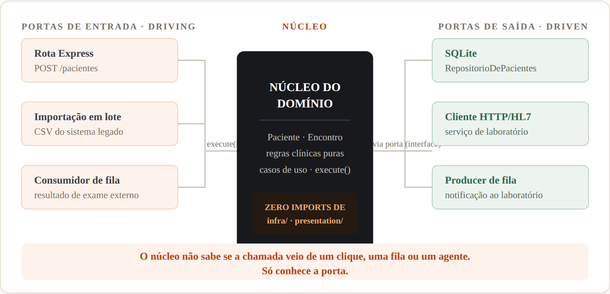
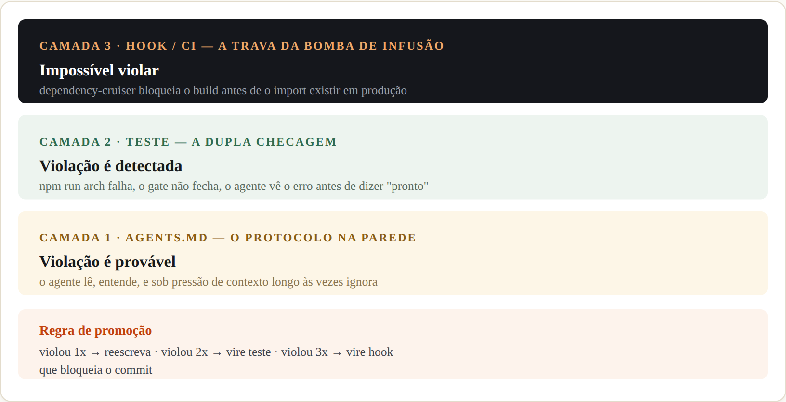
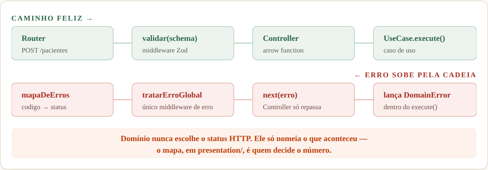

# Arquitetura Hexagonal na era dos agentes: portas, adaptadores e protocolos que não se pode violar

> *A mesma ideia de Alistair Cockburn — isolar o núcleo de negócio do mundo exterior — ganha um motivo novo e mais urgente para existir: quando quem escreve código é um agente de IA, a fronteira do hexágono deixa de ser um diagrama bonito e vira o único freio que continua funcionando quando você não está olhando.*

Arquiteturas de Referência · Separação de Preocupações · TEC.1052 — Programação para Internet II · IFPI 2026.2

- **Baseado em** — Rafael Miguel, ["Arquitetura Hexagonal", Chronicles of a Pragmatic Programmer](https://chroniclesofapragmaticprogrammer.substack.com/p/arquitetura-hexagonal)
- **Atualizado por** — Prof. Rogério Silva com Claude, 2026
- **Estudo de caso** — Mini-Prontuário Eletrônico (FHIR-lite)

**Neste artigo**

1. [O núcleo e o hospital que não pergunta quem bateu à porta](#o-núcleo-e-o-hospital-que-não-pergunta-quem-bateu-à-porta)
2. [O que muda em 2026: fronteira virou contrato executável](#o-que-muda-em-2026-a-fronteira-virou-contrato-executável)
3. [A estrutura em TypeScript + Express](#a-estrutura-em-typescript--express)
4. [Casos de uso como comandos: CQS de método único](#casos-de-uso-como-comandos-o-padrão-cqs-de-método-único)
5. [AGENTS.md do Mini-Prontuário, com `agy`](#agentsmd-do-mini-prontuário-com-agy)
6. [INVARIANTES.md: do desenho ao teste que morde](#invariantesmd-do-desenho-no-quadro-ao-teste-que-morde)
7. [Escrevendo a tarefa para o agente](#escrevendo-a-tarefa-para-o-agente)
8. [Quatro hábitos de prompt que valem a arquitetura toda](#quatro-hábitos-de-prompt-que-valem-a-arquitetura-toda)
9. [O portão e a revisão adversarial](#o-portão-e-a-revisão-adversarial)
10. [Por que isso importa mais, não menos, com IA](#por-que-isso-importa-mais-não-menos-com-ia)

---

Alistair Cockburn resumiu a motivação da Arquitetura Hexagonal numa frase que qualquer desenvolvedor reconhece de cor: ele estava cansado de apagar incêndios. Sistemas onde a regra de negócio e o framework viviam grudados, onde trocar de banco de dados era uma cirurgia, onde testar a lógica central exigia subir um servidor inteiro. A resposta dele — publicada no início dos anos 2000 — foi simples de enunciar e difícil de manter: **o núcleo não conhece o mundo exterior; o mundo exterior é que se adapta ao núcleo.**

Esse artigo é uma atualização daquela ideia para 2026, quando boa parte do código que entra no seu repositório não sai mais dos seus dedos — sai de um agente de IA. A arquitetura continua a mesma. O que mudou é o motivo pelo qual ela deixou de ser opcional. Vamos construir tudo isso em cima de um caso concreto: o **Mini-Prontuário Eletrônico**, o projeto-fio da disciplina, com vocabulário inspirado em HL7 FHIR — `Paciente`, `Encontro` — em TypeScript e Express.

## O núcleo e o hospital que não pergunta quem bateu à porta

Antes de qualquer diagrama, uma imagem simples. Pense numa central de triagem hospitalar. Um paciente pode chegar de quatro jeitos completamente diferentes: andando pela recepção, de ambulância pela emergência, transferido de outra unidade com uma guia em papel, ou por telefone, marcando uma consulta. Cada porta de entrada tem seu próprio ritual — a recepcionista com o formulário, o paramédico com o protocolo de emergência, a guia de transferência, a ligação telefônica.

Mas depois que o paciente está triado, o protocolo clínico que decide o que fazer com ele é **o mesmo**, não importa por qual porta ele entrou. O médico não trata diferente um paciente que chegou de ambulância de um que chegou andando, uma vez que os dois estão diante dele com a mesma queixa. O protocolo clínico — o núcleo — é indiferente à porta de entrada.

> 🏥 **A central de triagem**
>
> Isso é a Arquitetura Hexagonal em uma frase: **portas** são os contratos de entrada e saída que o núcleo entende (o formulário padronizado de triagem); **adaptadores** são os tradutores em cada porta física, que convertem o jeito particular de cada canal (fala, papel, rádio) para esse formulário comum. O núcleo — o protocolo clínico — nunca vê a ambulância, o telefone ou o papel timbrado de outro hospital. Ele só vê o formulário.

No Mini-Prontuário, o "formulário padronizado" é o par **DTO de entrada / DTO de saída** de cada caso de uso. As "portas físicas" são a rota HTTP que o navegador chama, o script de importação em lote que a secretaria roda uma vez por mês, o consumidor de fila que processa resultados de exame que chegam de um laboratório parceiro. Três portas de entrada completamente diferentes, uma única regra por trás delas: `RegistrarPaciente.execute(input)`.



**Fig. 1** — Três portas de entrada (driving), três portas de saída (driven), um único núcleo no meio. Cada caixa fora do centro é substituível sem que uma linha do domínio mude — é exatamente essa a promessa que Cockburn fez em 2005 e que continua valendo, agora sob outro nome de urgência.

## O que muda em 2026: a fronteira virou contrato executável

No artigo original, a Arquitetura Hexagonal é apresentada como resposta a um problema humano: times acoplam camadas por pressa, por desconhecimento, ou porque "só dessa vez" parecia mais rápido importar o ORM direto na regra de negócio. Esse problema não desapareceu — mas ganhou um segundo personagem, e esse personagem trabalha muito mais rápido que qualquer humano jamais trabalhou.

Um agente de IA não tem preguiça de escrever a camada de tradução certa. Ele tem, isso sim, uma tendência estrutural a pegar o caminho que *funciona agora* — importar o cliente do banco direto dentro do caso de uso, por exemplo, porque é mais rápido de escrever e os testes que existem hoje não vão notar. Ele não faz isso por preguiça: faz porque, olhando só para a tarefa em mãos, esse caminho realmente resolve o problema em mãos. A arquitetura só sobrevive se a fronteira parar de ser conselho e virar obstáculo físico.

> **Documentação oficial · Claude Code**
>
> Diferente das instruções do arquivo de contexto, que são *advisórias*, hooks são *determinísticos* e garantem que a ação aconteça — ou, neste caso, que não aconteça.

Isso dá à Arquitetura Hexagonal um papel novo em 2026. Ela deixa de ser só uma boa prática de design e passa a ser a unidade natural de **invariante arquitetural** — o tipo de regra que um linter de dependências consegue verificar em segundos, sem entender uma linha de regra de negócio. "Nada em `domain/` importa de `infra/`" é uma frase de dez palavras que `dependency-cruiser` transforma em um portão que barra o PR. Poucas decisões de arquitetura têm um custo de verificação tão baixo para um benefício tão alto contra um agente apressado.



**Fig. 2** — As mesmas três camadas de qualquer invariante, aplicadas à própria fronteira do hexágono. Uma bomba de infusão hospitalar não confia numa etiqueta escrita à mão para impedir uma dose letal — ela tem uma trava mecânica. A direção de dependência do seu domínio merece o mesmo padrão de confiança.

## A estrutura em TypeScript + Express

O hexágono, desenhado como pastas de um repositório Node.js, fica assim para o Mini-Prontuário — a mesma divisão em quatro camadas que o restante da disciplina já usa, agora nomeada em função das portas e adaptadores:

**`mini-prontuario/`**

```text
domain/              entidades, erros, invariantes de negócio
  Paciente.ts        agregado — construtor privado + fábrica
  Encontro.ts         agregado — transições de estado válidas
  DomainError.ts      classe-base; HTTP não existe aqui

application/         casos de uso — a camada das PORTAS
  pacientes/
    RegistrarPaciente.ts     comando · execute()
    ObterPaciente.ts         consulta · execute()
    portas/
      RepositorioDePacientes.ts    porta de saída (interface)
  encontros/
    RegistrarEncontro.ts
    portas/
      RepositorioDeEncontros.ts

infra/              ADAPTADORES de saída — implementam as portas
  repositorios/
    RepositorioDePacientesSqlite.ts
    RepositorioDeEncontrosSqlite.ts
  laboratorio/
    ClienteLaboratorioHttp.ts

presentation/       ADAPTADORES de entrada — traduzem HTTP para a porta
  rotas/
    pacientes.rotas.ts        router: valida → delega ao controller
    encontros.rotas.ts
  controllers/
    PacientesController.ts     métodos como arrow function
    EncontrosController.ts
  middlewares/
    validar.ts                  injeta validação Zod por rota
    tratarErroGlobal.ts          único ponto que monta a resposta
  erros/
    mapaDeErros.ts               codigo do domínio → status HTTP
  schemas/
    RegistrarPacienteSchema.ts
  composicao.ts                  monta casos de uso + controllers
```

Repare no que essa árvore não tem: nenhuma pasta chamada `services/` genérica, nenhuma pasta `utils/` onde tudo o que não se sabe onde colocar acaba indo parar. Cada pasta responde a uma pergunta do hexágono — *o que é regra?* (`domain/`), *o que é orquestração da regra?* (`application/`), *o que fala com o mundo de fora e entra?* (`presentation/`), *o que fala com o mundo de fora e sai?* (`infra/`).

## Casos de uso como comandos: o padrão CQS de método único

A camada `application/` é onde o hexágono ganha forma concreta em código, e aqui adotamos um padrão específico: **Command-Query Separation** no nível de classe. Cada operação de negócio é sua própria classe, com um único método público: `execute()`. Nada de uma classe `PacienteService` com dez métodos disputando espaço e contexto — dez classes de uma responsabilidade cada.

> ❌ **Serviço genérico — evitar**
>
> `PacienteService` com métodos `criar()`, `atualizar()`, `buscarPorId()`, `buscarPorCns()`, `listar()` todos numa classe só. Toda mudança em qualquer operação de paciente mexe no mesmo arquivo — e é exatamente o arquivo que o agente vai reabrir com mais contexto acumulado de tarefas anteriores.

> ✅ **Comando por classe — usar**
>
> `RegistrarPaciente`, `ObterPaciente`, `BuscarPacientePorCns`: cada um com `execute()`, cada um testável isolado, cada um com sua própria porta de entrada e porta(s) de saída explícitas no construtor.

A porta de entrada de cada caso de uso é a própria interface do método — o par `Input`/`Output`. A porta de saída é toda dependência externa que o caso de uso precisa, declarada como interface e injetada pelo construtor. Isso não é apenas estilo: é a Arquitetura Hexagonal aplicada literalmente, uma porta por dependência, tantas quantas forem necessárias.

**`application/portas/UseCase.ts`**

```typescript
// contrato comum a todo caso de uso — a "forma" da porta de entrada
export interface UseCase<Input, Output> {
  execute(input: Input): Promise<Output>;
}
```

**`application/pacientes/portas/RepositorioDePacientes.ts`**

```typescript
// porta de SAÍDA — o núcleo declara o que precisa, não como é feito
export interface RepositorioDePacientes {
  salvar(paciente: Paciente): Promise<void>;
  buscarPorCns(cns: string): Promise<Paciente | null>;
}
```

**`domain/Paciente.ts`**

```typescript
export class Paciente {
  private constructor(
    readonly id: string,
    readonly nome: string,
    readonly cns: string,
    readonly dataNascimento: Date,
  ) {}

  // fábrica: único portão de entrada para criar um Paciente válido
  static registrar(dados: {
    nome: string; cns: string; dataNascimento: Date;
  }): Paciente {
    if (!/^\d{15}$/.test(dados.cns)) {
      throw new CnsInvalidoError(dados.cns);
    }
    return new Paciente(
      crypto.randomUUID(), dados.nome, dados.cns, dados.dataNascimento,
    );
  }
}
```

**`application/pacientes/RegistrarPaciente.ts`**

```typescript
export interface RegistrarPacienteInput {
  nome: string;
  cns: string;
  dataNascimento: string; // ISO 8601
}

export interface RegistrarPacienteOutput {
  id: string;
}

// comando · CQS: efeito colateral, retorno mínimo, um único execute()
export class RegistrarPaciente
  implements UseCase<RegistrarPacienteInput, RegistrarPacienteOutput> {

  constructor(private readonly pacientes: RepositorioDePacientes) {}

  async execute(input: RegistrarPacienteInput): Promise<RegistrarPacienteOutput> {
    const existente = await this.pacientes.buscarPorCns(input.cns);
    if (existente) {
      throw new CnsDuplicadoError(input.cns);
    }

    const paciente = Paciente.registrar({
      nome: input.nome,
      cns: input.cns,
      dataNascimento: new Date(input.dataNascimento),
    });

    await this.pacientes.salvar(paciente);
    return { id: paciente.id };
  }
}
```

Do lado da consulta, o mesmo padrão, sem efeito colateral — só leitura, e o retorno já é o DTO que a apresentação precisa, sem vazar a entidade de domínio para fora do hexágono:

**`application/pacientes/ObterPaciente.ts`**

```typescript
export interface ObterPacienteOutput {
  id: string; nome: string; cns: string;
}

// consulta · CQS: sem efeito colateral, sempre retorna o mesmo formato
export class ObterPaciente
  implements UseCase<{ cns: string }, ObterPacienteOutput | null> {

  constructor(private readonly pacientes: RepositorioDePacientes) {}

  async execute({ cns }: { cns: string }): Promise<ObterPacienteOutput | null> {
    const paciente = await this.pacientes.buscarPorCns(cns);
    if (!paciente) return null;
    return { id: paciente.id, nome: paciente.nome, cns: paciente.cns };
  }
}
```

Os adaptadores fecham o ciclo — sem nunca vazar para dentro do domínio. O de saída implementa a porta com SQLite; o de entrada traduz a requisição HTTP para o `Input` e o erro de domínio para um status:

**`infra/repositorios/RepositorioDePacientesSqlite.ts`**

```typescript
export class RepositorioDePacientesSqlite implements RepositorioDePacientes {
  constructor(private readonly db: Database) {}

  async salvar(paciente: Paciente): Promise<void> {
    this.db.prepare(
      `INSERT INTO pacientes (id, nome, cns, data_nascimento)
       VALUES (?, ?, ?, ?)`,
    ).run(paciente.id, paciente.nome, paciente.cns, paciente.dataNascimento.toISOString());
  }

  async buscarPorCns(cns: string): Promise<Paciente | null> {
    const linha = this.db.prepare(
      `SELECT * FROM pacientes WHERE cns = ?`,
    ).get(cns);
    return linha ? mapearLinhaParaPaciente(linha) : null; // snake_case → camelCase aqui, nunca fora daqui
  }
}
```

### Rota fina, Controller com um único trabalho: traduzir

Até aqui a rota fazia três coisas ao mesmo tempo — validar, chamar o caso de uso, decidir o formato da resposta. Isso funciona para um endpoint. Para vinte, a rota vira o novo lugar onde lógica se esconde, exatamente o problema que o hexágono existe para evitar do outro lado da fronteira. A correção é a mesma receita de sempre: **uma responsabilidade por classe.** O **Controller** é o adaptador de entrada de verdade — a rota só liga fios.

**`presentation/controllers/PacientesController.ts`**

```typescript
export class PacientesController {
  constructor(
    private readonly registrarPaciente: RegistrarPaciente,
    private readonly obterPaciente: ObterPaciente,
  ) {}

  // arrow function de campo: "this" fica preso ao Controller,
  // mesmo quando o Express chama o método fora de contexto
  registrar = async (req: Request, res: Response, next: NextFunction) => {
    try {
      const resultado = await this.registrarPaciente.execute(req.body);
      res.status(201).json(resultado);
    } catch (erro) {
      next(erro); // nunca decide status aqui — só repassa
    }
  };

  obterPorCns = async (req: Request, res: Response, next: NextFunction) => {
    try {
      const paciente = await this.obterPaciente.execute({ cns: req.params.cns });
      if (!paciente) {
        throw new PacienteNaoEncontradoError(req.params.cns);
      }
      res.status(200).json(paciente);
    } catch (erro) {
      next(erro);
    }
  };
}
```

> **Por que arrow function de campo, e não método comum**
>
> Um método comum (`registrar(req, res, next) { ... }`) perde o `this` quando o Express o chama como referência solta — `router.post('/x', controller.registrar)` passa a *função*, não o objeto. Sem arrow function, cada rota precisaria de `controller.registrar.bind(controller)` espalhado em `composicao.ts`. Arrow function de campo resolve isso uma vez, na definição da classe, e nunca mais se pensa nisso.

> ❌ **Rota gorda — evitar**
>
> Validação, chamada do caso de uso e formatação da resposta, tudo dentro de `router.post(...)`. Testar essa lógica exige subir o Express inteiro; revisar o diff de uma mudança pequena exige ler tudo de novo.

> ✅ **Rota fina — usar**
>
> `router.post('/pacientes', validar(Schema), controller.registrar)`. A rota declara *o quê* — método HTTP, caminho, validação — e delega inteiramente o *como* ao Controller.

**`presentation/rotas/pacientes.rotas.ts`**

```typescript
export function rotasDePacientes(controller: PacientesController): Router {
  const router = Router();

  router.post(
    '/pacientes',
    validar(RegistrarPacienteSchema),  // 1. valida o formato
    controller.registrar,               // 2. delega ao Controller
  );

  router.get('/pacientes/:cns', controller.obterPorCns);

  return router;
}
```

### Validação como middleware injetável, um `validar(schema)` por rota

A validação de formato — "isso é um CNS de 15 dígitos, ou não é" — não é regra de negócio, é forma de entrada. Ela mora numa fábrica de middleware: uma função que recebe um schema Zod e devolve o handler do Express, encaixado *antes* do Controller na cadeia da rota. Se a validação falhar, ela nunca chega ao Controller — vai direto para o middleware global de erro.

**`presentation/middlewares/validar.ts`**

```typescript
export function validar(schema: ZodSchema) {
  return (req: Request, res: Response, next: NextFunction) => {
    const resultado = schema.safeParse(req.body);
    if (!resultado.success) {
      return next(resultado.error); // ZodError — o middleware global sabe ler
    }
    req.body = resultado.data; // corpo tipado e já saneado a partir daqui
    next();
  };
}
```

**`presentation/schemas/RegistrarPacienteSchema.ts`**

```typescript
export const RegistrarPacienteSchema = z.object({
  nome: z.string().min(1),
  cns: z.string().regex(/^\d{15}$/, 'CNS deve ter 15 dígitos'),
  dataNascimento: z.string().datetime(),
});
```

### Erro de domínio continua sem saber o que é HTTP — quem traduz é o mapa

O `domain/` não ganha nenhuma ideia nova nesta evolução — ele continua isolado, exatamente como no invariante A1. O que muda é *como* a fronteira traduz o erro para fora. Em vez de uma cadeia de `if (erro instanceof X)` crescendo dentro do middleware a cada novo erro criado, cada erro de domínio carrega um `codigo` — uma string semântica, não um número HTTP — e uma tabela em `presentation/` decide o status a partir dele.

**`domain/DomainError.ts`**

```typescript
export abstract class DomainError extends Error {
  abstract readonly codigo: string; // semântico — não é status HTTP
  constructor(message: string, readonly details?: Record<string, unknown>) {
    super(message);
  }
}

export class CnsDuplicadoError extends DomainError {
  readonly codigo = 'CNS_DUPLICADO';
  constructor(cns: string) {
    super(`CNS ${cns} já cadastrado`, { cns });
  }
}

export class PacienteNaoEncontradoError extends DomainError {
  readonly codigo = 'PACIENTE_NAO_ENCONTRADO';
  constructor(id: string) {
    super(`Paciente ${id} não encontrado`, { id });
  }
}

export class EncontroFinalizadoError extends DomainError {
  readonly codigo = 'ENCONTRO_FINALIZADO';
  constructor(encontroId: string) {
    super(`Encontro ${encontroId} já finalizado`, { encontroId });
  }
}
```

**`presentation/erros/mapaDeErros.ts`**

```typescript
// única fonte de verdade: codigo do domínio → status HTTP
// adicionar um erro novo é adicionar uma linha aqui, não editar o middleware
export const mapaDeErros: Record<string, number> = {
  CNS_DUPLICADO: 409,
  PACIENTE_NAO_ENCONTRADO: 404,
  ENCONTRO_FINALIZADO: 409,
};

export const STATUS_PADRAO_DOMINIO = 400;
```

**`presentation/middlewares/tratarErroGlobal.ts`**

```typescript
// único middleware de erro do app — registrado por último, depois de todas as rotas
export function tratarErroGlobal(erro: unknown, req: Request, res: Response, next: NextFunction) {
  if (erro instanceof ZodError) {
    return res.status(400).json({
      mensagem: 'Dados inválidos',
      codigo: 'ENTRADA_INVALIDA',
      details: erro.flatten().fieldErrors,
    });
  }

  if (erro instanceof DomainError) {
    const status = mapaDeErros[erro.codigo] ?? STATUS_PADRAO_DOMINIO;
    return res.status(status).json({
      mensagem: erro.message,
      codigo: erro.codigo,
      details: erro.details ?? null,
    });
  }

  console.error(erro); // erro não mapeado: log completo, resposta genérica
  return res.status(500).json({
    mensagem: 'Erro interno',
    codigo: 'ERRO_INTERNO',
  });
}
```



**Fig. 3** — Duas linhas do tempo da mesma requisição. Em cima, o caminho de sucesso, sempre para a frente. Embaixo, o caminho de erro — que sobe de volta pela mesma cadeia via `next(erro)`, até o único middleware que sabe montar uma resposta de erro.

O ganho não é só estético. Adicionar um erro de negócio novo — digamos, um limite de tentativas de login — vira uma linha em `mapaDeErros.ts`, não uma edição no meio de um `if/else` que já tem dez casos. E qualquer revisor, humano ou `agy`, consegue conferir a cobertura completa de erros olhando um único arquivo pequeno, em vez de caçar `instanceof` espalhados pela base de código.

## AGENTS.md do Mini-Prontuário, com `agy`

Três ferramentas dominam o desenvolvimento assistido por agentes em 2026 — Claude Code, Codex e o Antigravity CLI, cujo binário se chama `agy`. As três leem `AGENTS.md` nativamente (o Claude Code lê via importação de duas linhas), então um arquivo único basta para qualquer uma delas — inclusive para a ferramenta padrão adotada nesta disciplina.

**`AGENTS.md — Mini-Prontuário`**

```markdown
# AGENTS.md — Mini-Prontuário (FHIR-lite)

## Stack
Node.js 20 / Express 5 / TypeScript / better-sqlite3
Validação: Zod · Sem ORM

## Comandos
npm run dev              sobe o servidor local
npm run gate              lint + types + arch + test, nessa ordem
npm run test:one -- <t>   teste único (PREFIRA este)

## Layout
domain/          entidades, erros de domínio, invariantes
                  ZERO imports de application/infra/presentation
application/      casos de uso (1 classe = 1 operação), portas
infra/            adaptadores: sqlite, filas, integrações externas
presentation/      rotas (finas) + controllers + schemas Zod
                  + middlewares HTTP

## Convenções que divergem do padrão
- Caso de uso é classe com um único método `execute()`.
  Nome no infinitivo do domínio: RegistrarPaciente,
  ObterPaciente, RegistrarEncontro.
- Toda porta (entrada e saída) é uma interface em
  application/. Adaptador nunca é referenciado fora de
  infra/ e presentation/.
- Controller é classe; método de rota é arrow function de
  campo (`metodo = (req, res, next) => {...}`), nunca
  método comum — evita `.bind(this)` espalhado.
- Rota só faz: `validar(schema) → controller.metodo`.
  Nenhuma lógica de negócio em rotas/.
- Erro de domínio expõe `codigo` (string semântica), nunca
  status HTTP. presentation/erros/mapaDeErros.ts traduz
  codigo → status. tratarErroGlobal é o único middleware
  que monta resposta de erro.

## Regras de trabalho
- Antes de criar um caso de uso, olhe um irmão existente
  em application/pacientes/ e siga a mesma forma.
- Erro de domínio novo: crie a classe em domain/, some o
  `codigo` em mapaDeErros.ts. Não edite tratarErroGlobal.
- snake_case do banco vira camelCase dentro do repositório
  — nunca vaza para application/.
- Rode `npm run gate` antes de dizer que a tarefa terminou.

## Do-not
- Não abra conexão com o banco fora de
  infra/repositorios/.
- Não adicione framework de DI. Composição manual em
  presentation/composicao.ts.
- Não desabilite regra do dependency-cruiser para o gate
  passar. Corrija a dependência, não a régua.
- Não empilhe `if (erro instanceof X)` dentro do
  middleware global. Adicione uma entrada em
  mapaDeErros.ts.

## Invariantes
Ver INVARIANTES.md. Se a tarefa parecer exigir violar um
deles, PARE e pergunte antes de prosseguir.

## Agente padrão desta disciplina
Usamos `agy` (Antigravity CLI) em sala.
`agy inspect` mostra o que foi carregado deste arquivo
antes de cada tarefa — rode sempre no início da sessão.
```

Pouco mais de quarenta linhas — o mesmo tamanho que se espera de qualquer `AGENTS.md` saudável, porque cada linha respondeu "sim" à pergunta que organiza o arquivo inteiro: *remover isto faria o agente cometer um erro?* A explicação de que "Paciente é uma entidade de domínio importante" não entra — o agente já sabe ler o código e descobrir isso. A convenção de nomear casos de uso no infinitivo entra, porque é uma escolha nossa que nenhum modelo adivinha sozinho.

## INVARIANTES.md: do desenho no quadro ao teste que morde

O hexágono, sozinho, protege a *direção* das dependências. Mas o Mini-Prontuário tem regras de negócio que também precisam sobreviver a um agente apressado — e essas regras não moram numa seta do diagrama, moram dentro da entidade, onde não existe caminho alternativo para contorná-las.

> **Onde a regra de negócio não pode morar**
>
> Se a imutabilidade de um Encontro finalizado estiver checada num `if` espalhado pela rota, o agente vai contornar essa checagem na próxima feature — sem má intenção, porque o caminho alternativo *funciona* e os testes existentes continuam verdes. Regra que precisa sobreviver a agentes mora na entidade.

**`INVARIANTES.md — Mini-Prontuário`**

```markdown
### A1 — Direção de dependência

Invariante: domain/ não importa de application/, infra/
nem presentation/.

Caminho seguro: precisa de algo externo no domínio?
Declare uma interface em application/<contexto>/portas/
e implemente em infra/.

Enforcement: dependency-cruiser, regra
`no-domain-outbound`, roda em `npm run arch`.

### N1 — CNS do paciente é único

Invariante: não existem dois Pacientes com o mesmo CNS
no sistema.

Caminho seguro: RegistrarPaciente sempre consulta
buscarPorCns antes de criar. Nunca insira direto pelo
repositório fora do caso de uso.

Enforcement: RegistrarPaciente.execute() lança
CnsDuplicadoError se já existir
+ test_registrar_paciente_cns_duplicado_rejeita
(passa hoje e FALHA se a checagem for removida).

### N2 — Encontro finalizado é imutável

Invariante: depois que um Encontro muda para status
`finalizado`, nenhum campo clínico dele pode ser alterado.

Caminho seguro: uma correção pós-finalização cria um
Encontro de retificação vinculado ao original — nunca edita
o registro já assinado pelo profissional.

Enforcement: Encontro.registrarObservacao() lança
EncontroFinalizadoError se status = FINALIZADO
+ test_encontro_finalizado_rejeita_edicao.
```

N2 vale um comentário à parte. Registro clínico assinado não é um detalhe técnico — é um princípio do próprio prontuário eletrônico, com peso legal: uma vez que o profissional fechou o atendimento, o registro precisa continuar confiável para quem o ler depois, inclusive em auditoria. É exatamente o tipo de regra que, escrita só em prosa, um agente violaria sem perceber a gravidade — porque, do ponto de vista dele, "editar um campo" é uma operação inofensiva.

Uma seção final do arquivo, separada, cobre o que sempre exige aprovação humana explícita — independente de quão verde esteja o gate:

- Migração no schema do banco (tabelas de `pacientes` e `encontros`)
- Qualquer mudança em autenticação, autorização ou controle de acesso a dado de paciente
- Alteração no contrato público da API (rotas, formatos de payload já em uso)
- Qualquer alteração que amplie quem pode ler dado clínico — dado de saúde é dado sensível

Estes não dependem da disciplina do agente: têm hook de bloqueio de caminho protegido, o mesmo mecanismo já usado para `migrations/` e variáveis de ambiente em qualquer projeto — só que aqui a lista inclui explicitamente tudo que toca dado clínico.

## Escrevendo a tarefa para o agente

O formato de quatro campos — **Goal**, **Context**, **Constraints**, **Done when** — funciona particularmente bem em arquitetura hexagonal, porque cada campo tem um lugar natural para citar exatamente a camada certa: *Context* aponta o caso de uso-irmão a seguir, *Constraints* cita o invariante que não pode ser violado, *Done when* vira o teste que ataca a porta nova.

**`prompt ruim — o agente vai adivinhar a camada errada`**

```text
> adiciona registro de consulta no prontuário
```

Vago o bastante para o agente decidir sozinho onde mora a regra — e a decisão mais provável, sem constraints, é colocá-la na rota, porque é o caminho mais curto entre a requisição e a resposta. É exatamente o oposto do que queremos.

**`prompt bom — a mesma tarefa, com portas nomeadas`**

```text
Goal
Pacientes atendidos em consulta precisam ter o atendimento
registrado como recurso Encontro, vinculado ao Paciente por
pacienteId. Hoje só existe o cadastro de Paciente — não há
como registrar um atendimento.

Context
- @application/pacientes/RegistrarPaciente.ts (padrão de
  caso de uso a seguir)
- @presentation/controllers/PacientesController.ts (padrão
  de controller e rota a seguir)
- @domain/Paciente.ts
- @domain/DomainError.ts
- Vocabulário: Encontro = HL7 Encounter (motivo, data,
  status: em-andamento | finalizado)

Constraints
- INVARIANTES A1: domain/ sem imports de application/
  infra/presentation/
- Novo caso de uso RegistrarEncontro, único método execute()
- Nova porta de saída: RepositorioDeEncontros, em
  application/encontros/portas/
- EncontrosController com arrow function; rota só faz
  validar(schema) → controller.registrar
- Erro PacienteInexistenteError com `codigo` próprio +
  entrada nova em mapaDeErros.ts (404)
- Fora de escopo: edição de encontro existente, listagem
  por paciente, anexo de exame

Done when
- npm run gate passa
- test_registrar_encontro_paciente_inexistente_rejeita
  passa e FALHA se a validação for revertida
- POST /pacientes/:id/encontros retorna 201 com o id do
  encontro criado
- POST /pacientes/:id/encontros para paciente inexistente
  retorna 404, não 500
```

> **O teste do "falha se revertido"**
>
> Peça sempre isso no Done when: um teste que *falha* se a correção for desfeita. Um teste que passa antes e depois da mudança não está testando a mudança nenhuma — e um agente, sob pressão de fechar a tarefa rápido, escreve esse tipo de teste inofensivo com facilidade desconfortável.

## Quatro hábitos de prompt que valem a arquitetura toda

A arquitetura hexagonal, bem desenhada, não te protege de um prompt ruim — ela só torna mais barato consertar o estrago, porque o estrago fica contido numa camada. Quatro hábitos, aplicados a qualquer prompt de implementação neste projeto:

- **Arquivos com `@`** em vez de descrever onde o código mora. "`@application/pacientes/RegistrarPaciente.ts`" custa três tokens e elimina uma rodada inteira de busca.
- **Um padrão-irmão existente a seguir.** "Veja como `RegistrarPaciente` separa porta de entrada e porta de saída" vale mais que três parágrafos explicando CQS.
- **O sintoma, não o diagnóstico**, quando for bug. "O CNS duplicado não retorna 409, retorna 500" é melhor que "a validação de CNS está quebrada" — você pode estar errado sobre a causa, e o agente perde tempo confirmando o seu diagnóstico antes de olhar o sintoma de verdade.
- **Contrato de API em texto, não em prosa.** Cole o schema Zod ou o exemplo de payload — é o "formulário padronizado" da nossa analogia, e funciona pelo mesmo motivo.

| Pedido vago | Pedido verificável |
|---|---|
| "valida o CNS" | "escreva `validarCns`. Casos: 15 dígitos numéricos → válido; menos de 15 → inválido; com letras → inválido. Rode os testes depois de implementar." |
| "o registro de consulta não fecha status" | "POST /pacientes/:id/encontros/:eid/finalizar não muda o status para `finalizado` no banco, só retorna 200. Corrija a causa raiz, não o retorno da rota." |
| "organiza o prontuário" | "mova a lógica de validação de CNS que está em `PacientesController.registrar` para dentro de `Paciente.registrar()`, seguindo INVARIANTES A1." |
| "adiciona teste pro paciente" | "escreva um teste para `RegistrarPaciente` cobrindo o caso de CNS já existente. Use um repositório fake, não mock de SQLite." |

## O portão e a revisão adversarial

Todo invariante deste artigo só é real se um único comando consegue verificá-lo, sempre na mesma ordem, rodando local e no CI. Para o Mini-Prontuário isso é um script pequeno — passos baratos primeiro, para falhar cedo e economizar tokens da sessão:

**`gate.sh`**

```bash
#!/usr/bin/env bash
set -euo pipefail

# 1 formato e lint
npm run lint

# 2 tipos
npm run types          # tsc --noEmit

# 3 arquitetura — INVARIANTES A*
npm run arch           # dependency-cruiser

# 4 testes — inclui os que atacam N1, N2
npm run test

echo "gate ok"
```

E, como qualquer diff, o dele merece um revisor em contexto novo — alguém (ou algum agente) que não carrega o raciocínio de quem implementou, só o resultado. No caso de uma arquitetura em camadas, o que esse segundo olhar mais frequentemente pega é justamente o que a Camada 1 da Figura 2 deixa passar: um import que atravessou a fronteira sem que ninguém tivesse decidido isso conscientemente.

**`agy`**

```text
> Use um subagente para revisar o diff contra
  PLAN.md e INVARIANTES.md.

  Verifique:
  - domain/ não ganhou nenhum import de infra/ ou
    presentation/
  - o novo caso de uso tem um único método execute()
  - N2 (Encontro finalizado é imutável) não foi violado
  - toda porta nova tem uma interface correspondente em
    application/<contexto>/portas/

  Reporte lacunas de corretude e de fronteira arquitetural.
  NÃO reporte preferências de estilo.

$ agy inspect   # confirma o que o agente carregou antes da revisão
```

> **Aplicação imediata**
>
> Peça a esse mesmo revisor que rode `npm run arch` como parte da checagem. Um invariante arquitetural violado costuma aparecer ali antes de aparecer em qualquer leitura humana do diff — é a Camada 2 fazendo o trabalho que a Camada 1 não conseguiu garantir sozinha.

## Por que isso importa mais, não menos, com IA

A Arquitetura Hexagonal nasceu para resolver um problema de disciplina humana: equipes que, sob pressão de prazo, colam a regra de negócio no framework que está mais à mão. Em 2026, o "sob pressão de prazo" virou "sob pressão de terminar a tarefa em vinte segundos" — e o agente que faz isso não é preguiçoso nem descuidado. Ele só não tem, por padrão, nenhum motivo para preferir a porta certa à solução mais direta. Esse motivo é o que você instala.

> **A regra que organiza tudo, de novo**
>
> Um diagrama de hexágono no quadro nunca impediu ninguém de importar o SQLite direto no domínio. Um teste de arquitetura, sim. A fronteira que sobrevive a um agente é a que tem uma consequência mecânica quando é cruzada — não a que está bem desenhada no `docs/arquitetura.md`.

> **A fronteira do hexágono não é um desenho — é o que sobra depois que você tenta violá-la e falha.**

> **Quem entra pela porta muda a cada semana. O que está dentro do núcleo, quase nunca deveria.**

> **CLAUDE.md e AGENTS.md documentam a intenção. Teste e hook garantem o resultado — e só o resultado sobrevive a um agente com pressa.**

Volte à central de triagem uma última vez. Ninguém contrataria um paramédico brilhante e depois confiaria só na boa vontade dele para não pular a fila de emergência — existe protocolo, existe checagem dupla, existe alarme. Um agente de IA é, nesse sentido, exatamente esse paramédico: extraordinariamente competente na tarefa em mãos, e sem nenhuma obrigação de saber, sozinho, que o CNS não pode duplicar ou que um Encontro assinado não se edita. Essa obrigação é a arquitetura que você constrói ao redor dele — e é ela, não o talento do agente, que decide se o prontuário eletrônico do paciente ainda é confiável daqui a cinco anos.

---

## Fontes

- Artigo original: Rafael Miguel, ["Arquitetura Hexagonal: O que é, pra que serve e como pode salvar seu código do caos"](https://chroniclesofapragmaticprogrammer.substack.com/p/arquitetura-hexagonal), Chronicles of a Pragmatic Programmer.

- Arcabouço de desenvolvimento dirigido por IA (AGENTS.md, INVARIANTES.md, gate, camadas de enforcement, ciclo de tarefa, `agy`): material de apoio "Desenvolvimento Dirigido por IA" da disciplina.

- Estudo de caso e exemplos de código: Mini-Prontuário Eletrônico, projeto-fio de TEC.1052 — Programação para Internet II, IFPI Campus Teresina Central, 2026.2.

*🧩 Arquiteturas de Referência — Separação de Preocupações*
